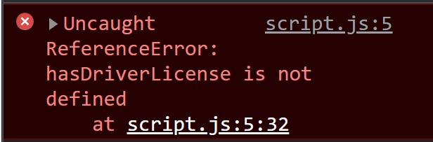

## strict 모드

strict 모드를 사용해야하는 이유
첫째, 우리가 특정 일을 하는 것을 금지합니다.
둘째, 실제로 눈에 보이는 오류를 생성합니다.

다음과 같은 상황에서 javascript는 오류를 내놓지 않는다. (변수명에 `s`가 빠진 상황)

```js
let hasDriversLicense = false;

const passTest = true;
if (passTest) hasDriverLicense = true;
if (hasDriversLicense) console.log("i can drive");
```

그래도 오류를 내놓지 않지만 첫째줄에

```js
"use strict";
```

를 써넣는다면 strict모드를 활성화하고  다음과 같은 오류를 보여준다.

또한 `interface`나 `private`같은 변수명도 사용하지 못하게 한다.

## 함수 선언식, 함수표현식

```js
// 함수 선언식
function calcAge1(birth) {
  return 2022 - birth;
}
const age1 = calcAge1(1997);

// 함수 표현식
const calcAge2 = function (birth) {
  return 2022 - birth;
};
const age2 = calcAge2(1997);
```

함수 선언식: 호이스팅이라는 과정 때문에 정의되기 전에 코드에서 호출할 수 있습니다.
함수표현식으로 동일한 작업을 시도하면 초기화 전에 calcAge2에 접근할 수 없습니다.

## 화삺표 함수

```js
const calcAge3 = (birth) => 2022 - birth;
```

인자 하나면 괄호 생략가능 함수 바디 한줄이면 return 생략가능
그러나 this 키워드 사용하지 못함

## 배열 메소드

`push` : 배열의 끝에 요소 추가, 배열 길이 반환
`unshift` : 배열 처음에 요소 추가, 배열 길이 반환

`pop`: 배열 끝 요소 삭제, 삭제된 요소 반환
`shift`:배열 처음 요소 삭제, 삭제된 요소 반환

`indexOf` : 배열안에 어떤값의 인덱스 반환 없으면 -1
`includes` : 배열안에 포함되어있으면 true 반환 없으면 false

## 객체 표기법

점으로 표기할 수도 있고, 괄호를 이용할 수 도있다.  
인풋값 동적으로 객체안의 요소를 나타내려면 괄호표기법을 사용하면 된다.
객체의 요소를 추가하기 위해서는 그냥 `arr.location = 'seoul';` 처럼 추가하면 된다.

```js
const arr = {
  name: "jeyoung",
  age: 26,
  friends: ["a", "b", "c"],
};

console.log(arr.name);
console.log(arr["name"]);
const a = "name";
console.log(arr[a]);
arr.location = "seoul";
```

## 객체 메소드

객체에 함수를 추가하고 `this` 키워드를 사용할 수 있다.

```js
const arr = {
  name: "jeyoung",
  friends: ["a", "b", "c"],
  birth: 1997,
  calcAge: function () {
    this.age = 2022 - this.birth;
    return this.age;
  },
};

console.log(arr.calcAge());
```

## for-of ,for-in

of는 배열 , in은 객체
