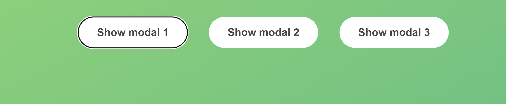

## modal 클래스 선택하기

평소처럼 어떠한 클래스를 가진 요소를 선택할 때 querySelector를 사용합니다.  
하지만 이번 프로젝트 처럼 여러개의 요소에서 같은 클래스를 가지고 있을 경우에 첫 번째 것만 선택됩니다.

따라서 querySelectorAll을 사용합니다.


## 요소를 변수에 넣고 시작하기

이전 프로젝트에서는 DOM 을 조작할 때마다 document.querySelector() 를 호출 했었다.  
하지만 반복적으로 호출해야 할 경우 변수에 저장하여 사용하는 것이 편리하다.

```js
"use strict";
const modal = document.querySelector(".modal");
const overlay = document.querySelector(".overlay");
const openModalBtn = document.querySelectorAll(".show-modal");
const closeModalBtn = document.querySelector(".close-modal");

for (const btn of openModalBtn) {
  console.log(btn.textContent);
}
```

## 모달 열고 닫기

재사용을 하기 위해 openModal과 closeModal 함수를 만들어 준 후  
cssList를 사용해서 hidden을 넣을 것인지 뺄 것인지 결정한다.

```js
const openModal = () => {
  modal.classList.remove("hidden");
  overlay.classList.remove("hidden");
};

const closeModal = () => {
  modal.classList.add("hidden");
  overlay.classList.add("hidden");
};
for (const btn of openModalBtn) {
  btn.addEventListener("click", openModal);
}

closeModalBtn.addEventListener("click", closeModal);
overlay.addEventListener("click", closeModal);
```

## esc 눌렀을 때 모달 닫히게 만들기

1. keyup
   키보드에서 손을 땠을 때 실행
2. keydown
   키보드를 눌렀을 때 실행
   키보드를 누르고 있을 때 한번만 실행됨
3. keypress
   키보드를 눌렀을 때 실행
   키보드를 누르고 있을 때 계속 실행됨

```js
document.addEventListener("keydown", (event) => {
  const isModalOpen = !modal.classList.contains("hidden");
  const escPressed = event.key === `Escape`;
  if (isModalOpen && escPressed) closeModal();
});
```
