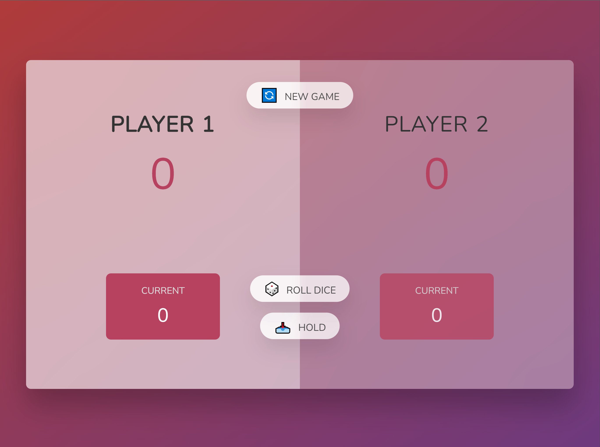

## Pig game


주사위를 굴리고 점수를 모아간다. 주사위를 계속 굴리면 점수가 누적된다.
100점을 모으는 게임이다. 그러면 100점이 될때까지 주사위를 굴리면 되지 않는가?  
하지만 이 게임의 중요한 규칙이 있다. 바로 1이 나오게 되면 이번턴에 모았던 점수를 모두 잃게 된다는 점. 하지만 점수를 잃기전에 저장하는 방법은 hold를 누르면된다. go를 할것인지 stop을 할것인지와 같다.

## 클린코드?

클린 코드 관점에서 짜려고 노력했지만 아직 스킬이 부족한 것 같다.
depth도 최대 3까지 짜려고 했고, 변수명도 구체적으로 지었으며, 함수한개당 15line이 넘어가지 않게 하려고 했다. 그런데도 봤을때 무언가 허접해보인다.  
react에서는 useState를 사용해서 switch가 일어났을 때 자동으로 변수들을 바꿔줄수 있지만 js에서는 그렇게 하는 스킬을 아직 터득하지 못해서 인지 다음과 같은 변수를 계속 선언해주어야만 했다.

```js
const currentPlayerContainer = document.querySelector(
  `.player--${currentPlayer}`
);
```
