# 개요

Javascript is a  
`high-level`,  
`prototype-based object-oriented`,  
`multi-paradigm`,  
`interpreted or just-in-time compiled`,  
`dynamic`,  
`single-thread`,  
`garbage-collected` programming language with  
`first-class function` and non-blocking  
`event loop concurrency model`

## 자바스크립트 엔진과 런타임

소스코드를 기계가 이해하려면 기계어로 바꾸는 과정이 필요하다. 기계어로 바꾸고 실행하는 방식은 여러가지가 있는데 다음과 같다.

### compilation

컴파일 언어의 실행과정은 먼저 소스코드를 전부 기계어로 번역한 후에 `portable` 파일을 만들어 놓는다. 그리고 실행하면 프로그램이 구동되게 되는데 컴파일 전에는 실행할 수 없다.

### interpretation

해석형 언어의 실행과정은 단순히 한줄을 읽고 그 줄을 기계어로 바꾸어 실행시킨다. 해석형 언어의 단점은 매우 느리다는데에 있다. 자바스크립트는 예전에 해석형 언어로서 사용이 되었지만 지금은 개선되어 하이브리드 형태를 취하고 있다.

### Just-in-time(JIT) compilation

두 형태를 혼합한 jit이다. 소스코드 전체를 먼저 기계어로 바꾸는 컴파일 과정이후에 `portable` 파일을 저장하지 않고 실행시킨다.

### js 엔진 작동 과정

Parsing : 소스코드를 통해서 AST(Abstract Syntax Tree, 추상 구문 트리)를 만든다. 언어에 의미 있는 조각으로 const 또는 function 키워드와 같은 모든 조각을 구조화된 방식으로 트리에 삽입 저장한다. (구문 오류도 확인)

Compilation : 그리고 생성된 AST를 가져와서 기계어로 컴파일. (Just in time)

Execution : 기계 코드는 즉시 실행 (Call Stack 에서)

Optimization : 최적화 (실행 도중에)

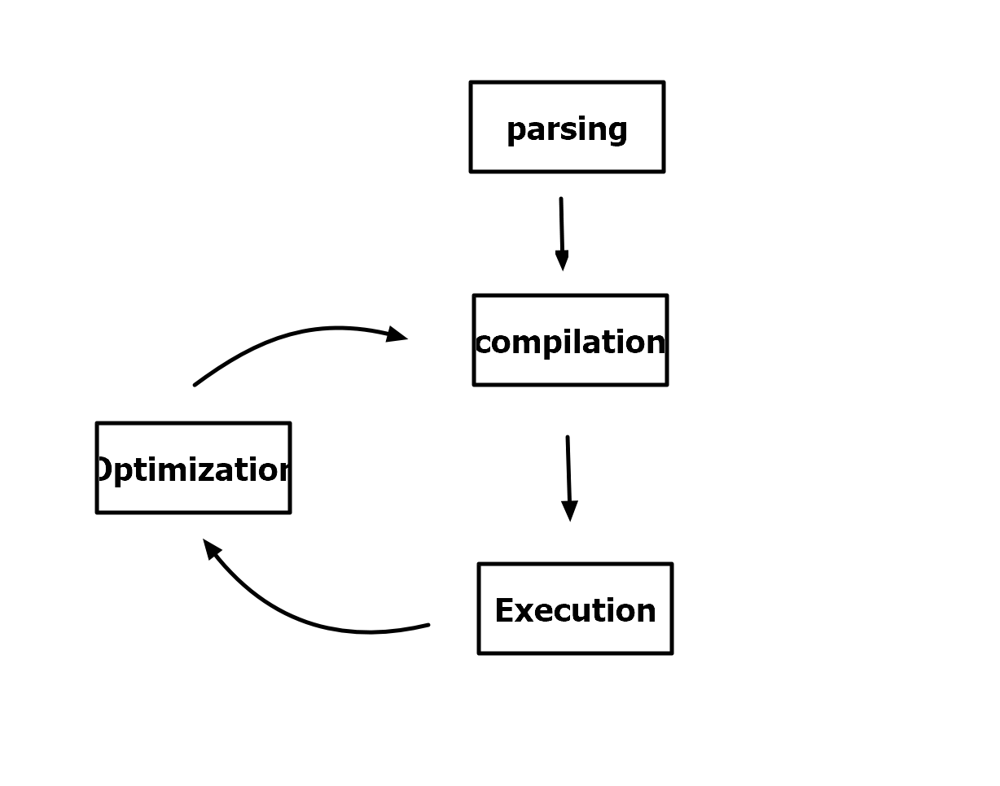

최적화를 시키고 실행을 하면 느려진다. 따라서 가능한 한 빨리 실행을 시작할 수 있도록 최적화되지 않은 기계어 코드 버전을 만든다.
그 다음 백그라운드에서 이 코드를 최적화한다. 이미 실행 중인 프로그램이 실행되는 동안 다시 컴파일된다. 최적화 후에 최적화되지 않은 코드는 단순히 스윕된다.

parsing, compilation, optimization은 코드가 접근할 수 없는 특별한 스레드에서 실행이 됨(메인스레드와 분리)

## 런타임

자바스크립트 런타임을 큰 박스라고 생각해보자. 우리가 필요로 하는 모든것을 포함하는 박스.
브라우저에서 자바스크립트를 실행하기위해선 엔진이 필요하다. 따라서 런타임은 항상 자바스크립트 엔진이다 (?)
런타임은 항상 자바스크립트 엔진 (엔진이 없으면 런타임도 없다.) 하지만 엔진으론 충분하지 않고 web api에 대한 접근 권한이 필요함. (DOM, Timer, fetch ...) 이런 웹api는 런타임의 일부이다.

자바스크립트 런타임은 또한 Callback queue를 포함한다. 실행준비가 된 모든 콜백함수를 포함하는 데이터 구조인데, 예를들어 이벤트 리스터 같은 함수들은 콜백함수이다. 콜백함수가 실행이되면 콜백 큐에 놓이게 되고 Call Stack이 비어 아무것도 없다면 콜백 큐에서 콜백함수가 스택으로 전달이 된다. 이것을 `이벤트 루프`라고 부른다.
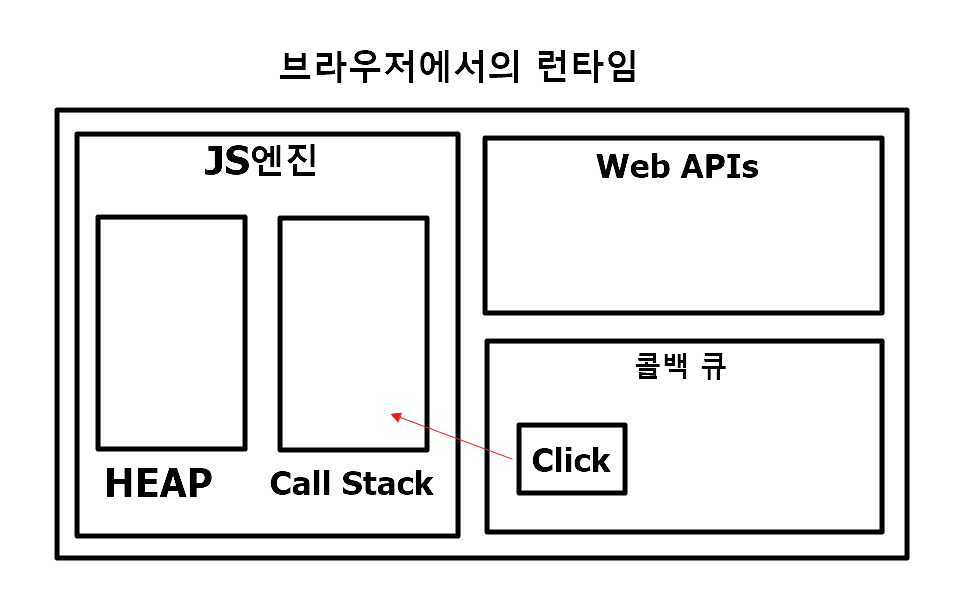
이 이벤트 루프는 자바스크립트를 non-blocking으로 만든다.

node js 의 런타임 같은 경우에는 web apis 가 없고 그 자리에 c++ bindings & thread pool 이 있다.

## Execution context 와 Call Stack

[설명](https://velog.io/@stampid/Execution-Context%EC%8B%A4%ED%96%89-%EC%BB%A8%ED%85%8D%EC%8A%A4%ED%8A%B8%EB%9E%80)
컴파일을 마친 이후에 javascript 파일 안에서 함수가 아닌 코드를 실행하기 위해선 전역 실행 컨텍스트 (global execution context)가 생성된다.(한개만 생성됨) 실행 컨텍스트는 코드가 실행되기 위해서 필요한 정보들을 저장하는 상자와 같다. 피자상자 = 피자 + 포크 라고 한다면 상자는 실행 컨텍스트 피자는 코드라고 할 수 있다.

그리고 함수가 아닌 코드들이 실행되고 나면 함수의 호출에 의해 각각의 실행컨텍스트가 생성이된다. 그리고 그 함수들은 Call Stack에 쌓이게 된다. 이제 모든 함수가 실행되고나면 콜백함수를 기다린다.

### what's inside execution context?

- variable environment (let, comst, var, function, arguments object)
- scope chain
- this keyword
  실행 컨텍스트 안에 무엇이 있는지 알아봅시다. ( arrow function에는 arguments object와 this keyword가 없다.)

```javascript
const name = "jeyoung";
const first = () => {
  let a = 1;
  const b = second(1, 2);
  return a + b;
};
function second(x, y) {
  const c = 2;
  return c;
}
const x = first();
```

위와 같은 코드가 있다고 했을 때, 전역 컨텍스트에서는 name이 정의되고 first와 second는 함수인지 판단하며 x 는 정의되지 않는다. 그리고 Call Stack에 전역 컨텍스트가 들어가게되고 first 함수가 실행됨에 따라서 새로운 실행컨텍스트가 생기며 콜스택에 들어간다.

어떤 함수가 끝날 때 이전에 실행했던 (그 함수를 호출했었던) 부분으로 어떻게 돌아갈까? 실행 컨텍스트는 함수가 실행되면서 생성되고 콜스택에 쌓이며 함수가 끝나면 해당 실행컨텍스트는 스택에서 없어진다. 따라서 원래 실행되고 있었던 실행컨텍스트로 돌아갈 수 있다.

## Scope and Scope Chain

변수는 어디에 있으며 특정 변수에 액세스할 수 있는 위치와 액세스할 수 없는 위치는 어디일까?

scope 와 variable environment의 차이는 뭘까?

scope와 scope of variable은 다르다.
block scope라는 것은 es6이후 도입되었으므로 es6 변수인 let과 const에만 적용된다. var는 적용되지 않는다. var는 block scope가 아니라 function scope로 분류되기 때문에 `decade`와 다르게 `second` 함수에서 사용이 가능하다.

scope chain이라는 것은 바깥에서 정의된 변수들을 안쪽 스코프에서 사용할 수 있음을 말한다.
다음 사진을 보면 이해할 수 있다. 해당 scope에서 변수를 찾을 수 없는 경우 scope chain을 따라 위쪽으로 이동하면서 global scope까지 올라간다. 그 때까지 변수를 찾지못하면 reference error가 생긴다. 그리고 이 방향성은 단방향이다 바깥쪽 함수에서 안쪽에 있는 변수를 이용하진 못한다.

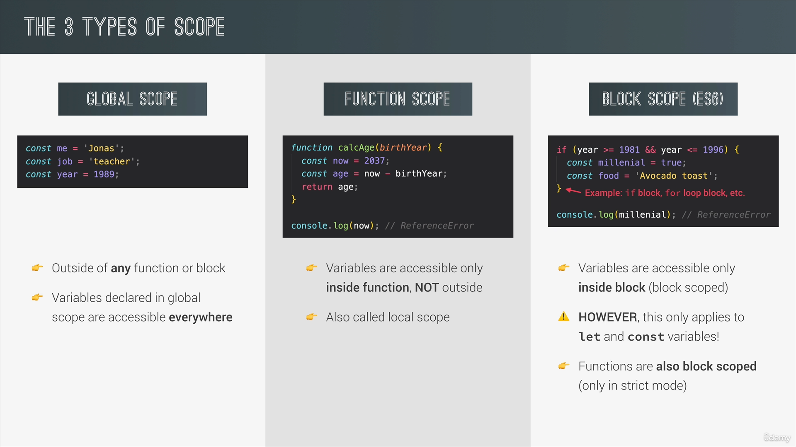
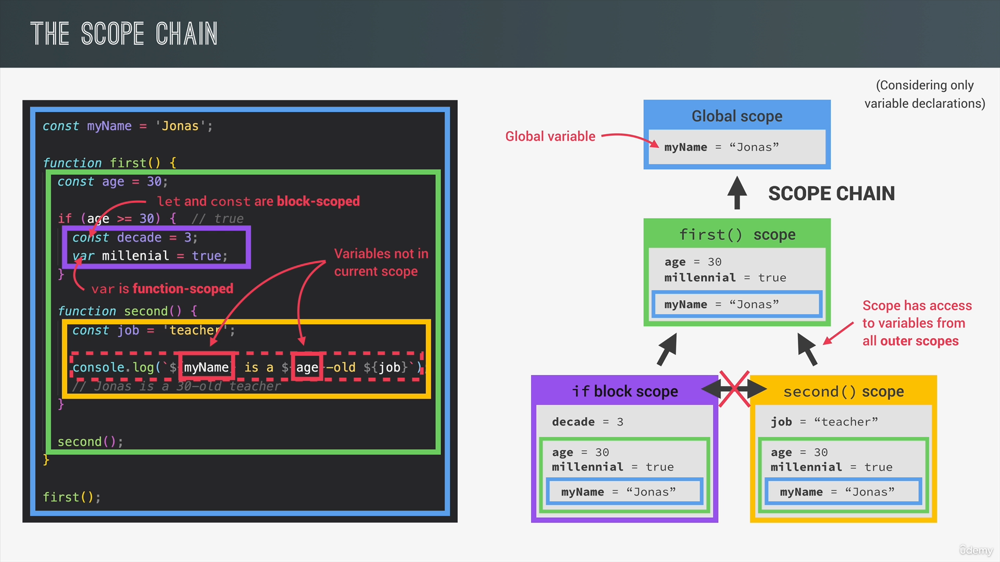

주의할 점이 있는데 call stack과 scope chain은 무관하다는 것이다. 아래 사진을 보면 third는 second안에서 실행되었지만 scope가 first와 평행하기 때문에 변수에 접근할 수 없다
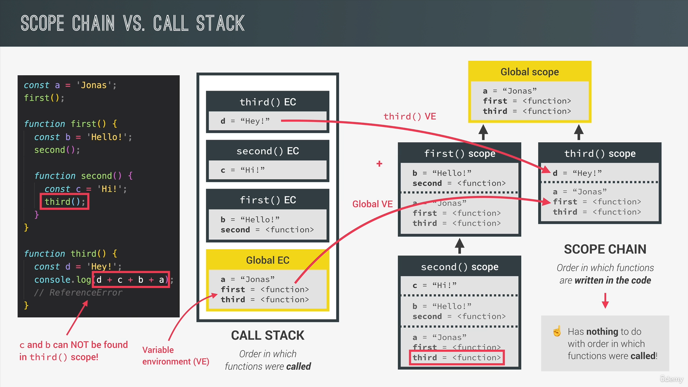
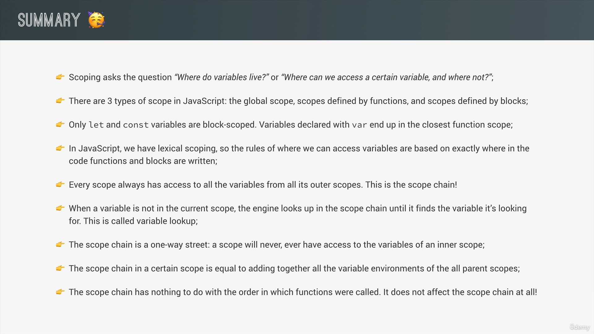

## 연습하기

바깥쪽 함수의 변수와 같은 이름으로 내부 함수에서 정의했을 때는 이름만 같고 스코프가 다르기 때문에 정의할 수 있다.
바깥쪽 함수의 변수를 재할당하면 값을 바꿀 수 있다.

# 호이스팅

일반적으로 호이스팅이라고 하면 함수와 변수를 코드의 맨위로 올리는 작업이라고 생각한다.  
하지만 뒷배경은 그렇지 않다.  
실행 컨텍스트 생성 단계에서 변수 선언이 실행되기 전에 코드는 기본적으로 스캔되는 과정을 겪는다. 그런 변수 환경 개체(variable environment)에서 다음 코드에서 찾은 각 변수에 대해 새 속성이 생성된다.
.png>)

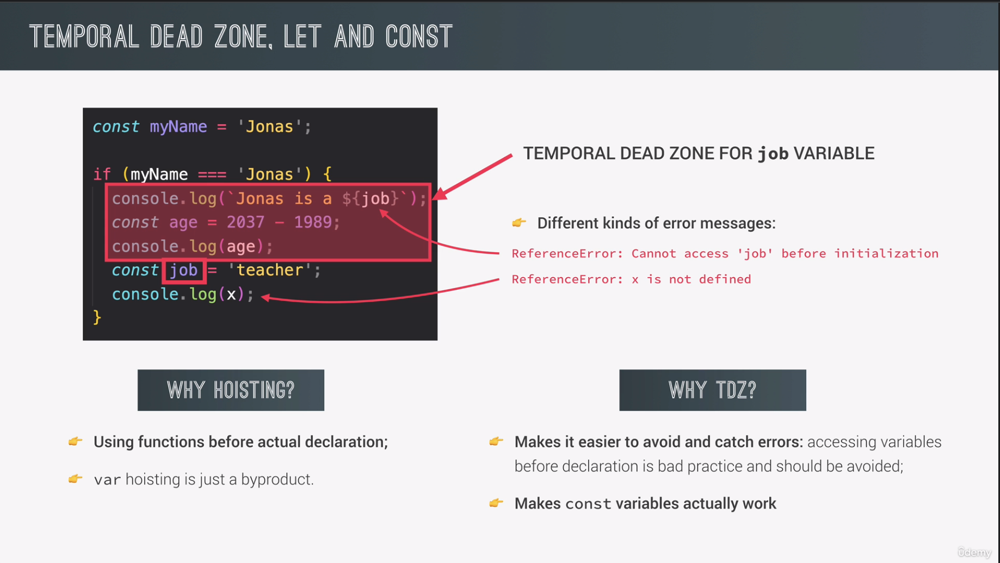
위의 사진을 보면 job이란 변수는 이후 초기화가 된다. 따라서 cannot access before init 오류가 뜨게 되는 것이고, x는 이후에도 초기화 되지 않기 때문에 not defined 오류가 뜨는 것이다. 컴파일 단계에서 이를 다 파악하고 오류를 내보낸다. 하지만 var 변수는 undefined로 호이스팅 되기 때문에 선언 전에도 사용할 수가 있다.

그게 무슨 상관이 있지?
그렇다면 호이스팅은 왜 사용하지? 에 대한 의문점은 let과 const 이후 설명한다.

### TDZ(Temporal dead zone)

let과 const는 호이스팅을 사용하지 않고 선언되기 전에는 Temporal Dead Zone에 있다고 한다. (TDZ) 따라서 선언 전에는 변수를 사용할수가 없는데 이 TDZ는 왜 필요한것일까?  
첫번째로는 오류를 잡아내기 쉽게 만들어주기 때문이다.  
두번째는 const라는 상수는 초기화 이후 바뀌면 안되는데 undefined였다가 바뀌는 것은 모순적인 일이기 때문에 정말로 const의 역할을 잘 수행하게 하기 위해서 이다.

#

### 왜 호이스팅?

그렇게 오류를 잡아내기 쉬운 방식이 있는데 왜 var이란 변수가 나왔고, 왜 호이스팅을 하게 되는 것일까? 이는 함수를 보아야하는데 가끔 일부 프로그래밍 기술의 경우 상호 재귀와 같은 기법을 사용해야 하는데 이를 해결하는 방법이 호이스팅이었다. 그래서 함수의 선언 위치와 상관없이 이를 이용할수 있도록 한것인데 var이란 변수는 이 해결 기법의 부산물인 것이다. 자바스크립트는 지금만큼 많은 사람들이 이용할줄 몰랐기 때문이다.

#

### 실습

const도 마찬가지이다. var은 호이스팅으로 undefined이지만 let과 const는 TDZ에 있다.

```js
console.log(a);
console.log(b);
// console.log(c);

var a = 1;
let b = 2;
const c = 3;
```

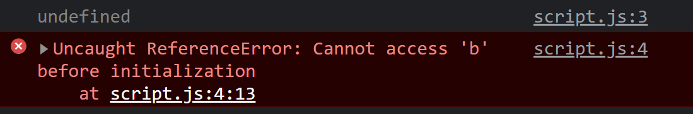

함수의 경우를 보자.

```js
console.log(addDecl(1, 2));
console.log(addExp(1, 2));
console.log(addArr(1, 2));

function addDecl(a, b) {
  return a + b;
}

const addExp = function (a, b) {
  return a + b;
};

const addArr = (a, b) => a + b;
```

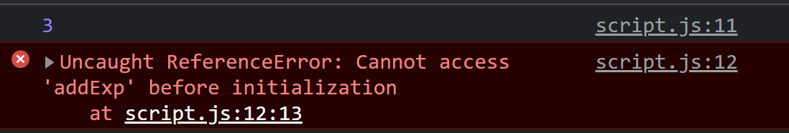

그렇다면 var로 초기화 하면 호이스팅 되지 않을까?

```js
console.log(addDecl(1, 2));
console.log(addExp(1, 2));
console.log(addArr(1, 2));

function addDecl(a, b) {
  return a + b;
}

var addExp = function (a, b) {
  return a + b;
};

var addArr = (a, b) => a + b;
```

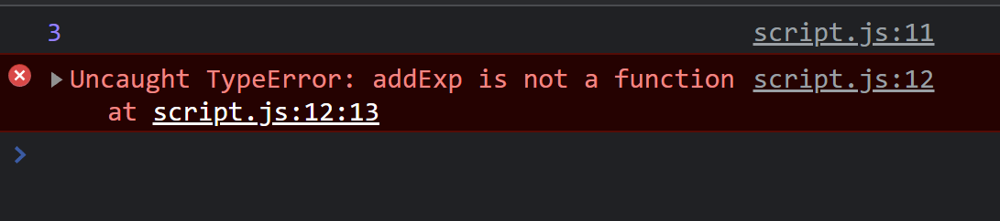

호이스팅 되기는 하지만 undefined이기 떄문에 함수로 판단하지 못하고 undefined(1,2); 를 하는 것과 같이 된다.

#

## var 변수가 문제가 될 수 있는 상황

다음과 같은 상황에서는 `deleteShoppingCart` 호출을 하는 함수를 어쩌다가 만들었다면 numProducts가 TDZ에 있는것이 아니고 `undefined`이기 때문에 10개를 가지고 있을 예정이지만 모든 상품이 지워질 수가 있다.

```js
console.log(undefined);
if (!numProducts) deleteShoppingCart();

var numProducts = 10;

function deleteShoppingCart() {
  console.log("All products deleted!");
}
```

#

# this 키워드

method 에서 this 키워드를 사용하면 this는 그 메소드를 호출한 객체가 된다.
일반 함수에서 this는 undefined이지만 만약 strict 모드를 사용하지 않는다면 window객체를 가리킬수 있고 이는 심각한 문제를 야기할 수도 있다.
arrow 함수에서는 기본적으로 this를 가질수 없지만 사용하게 된다면 lexical this로서 더 상위 혹은 전역 객체를 잡을 수 있다.
event listener에서는 DOM을 가리킨다.
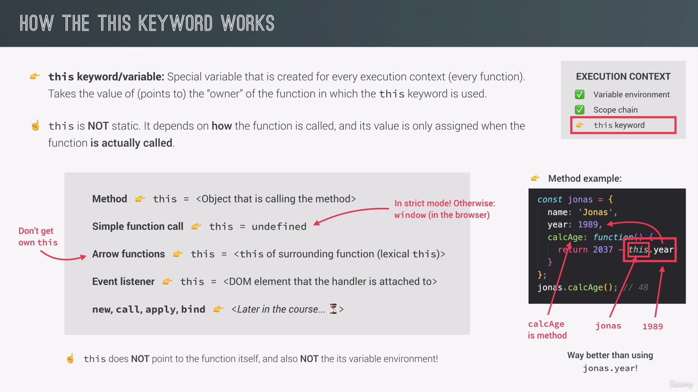

```js
console.log(this);

const calcAge = function (birthYear) {
  console.log(this);
};
calcAge(1991);

const calcAgeArrow = (birthYear) => {
  console.log(this);
};
calcAgeArrow(1980);
```

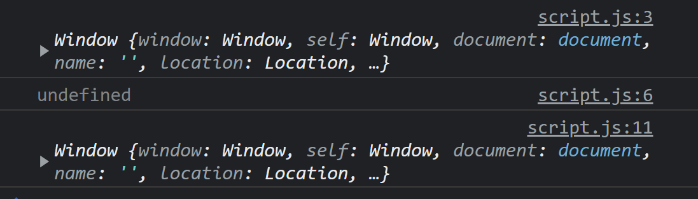
그냥 this를 호출하면 this를 호출하는 객체이므로 window가 나오는게 맞다.
strict모드를 사용하고 있으므로 함수 내부에서 this 를 호출 했을 때는 정의되지 않는게 맞다.
arrow 함수에서는 자체 this 키워드가 없으므로 상위 객체의 this를 갖는다. 전역에서 호출한것과 같이 window가 나온다.

### 객체에서 this 보기

```js
const a = {
  name: "a",
  showObject: function () {
    console.log(this);
  },
};
a.showObject();

const b = { name: "b" };
b.showObject = a.showObject;
b.showObject();

const f = b.showObject;
f();
```

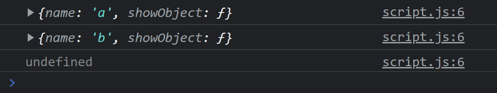

#

# 일반함수 vs arrow 함수

arrow 함수는 this 키워드가 없기 때문에 상위 객체의 this를 이용하는데 여기서 상위 객체는 window 이다. 따라서 window.name을 부르는것과 같다. 여기서 var를 사용하면 안되는 이유가 하나 더 나오는데 var 변수를 선언할 경우 window객체에 속성을 만들어 낸다.

```js
const me = {
  name: "jeyoung",
  printNameArr: () => {
    console.log("hi", this.name);
  },
  printNameDecl: function () {
    console.log("hi", this.name);
  },
};

me.printNameArr();
me.printNameDecl();
```

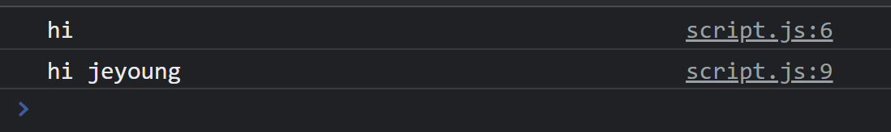

var 변수를 정의 하였을 경우 다음과 같은 결과를 얻게 된다.

```js
var name = "nayoung";
const me = {
  name: "jeyoung",
  printNameArr: () => {
    console.log("hi", this.name);
  },
  printNameDecl: function () {
    console.log("hi", this.name);
  },
};

me.printNameArr();
me.printNameDecl();
```

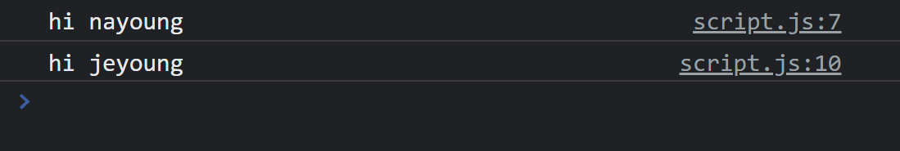

## 함수 내에서 함수를 호출할 때 this

다음과 같은 코드를 보자. `nextlevel`을 호출하고 있는 것은 printName이라는 함수이다. 그런데 일반함수의 this는 undefined이므로 아래 사진과 같은 결과가 나온다.

```js
const me = {
  name: "jeyoung",
  printName: function () {
    console.log("hi", this.name);

    const nextLevel = function () {
      console.log("next:", this);
    };
    nextLevel();
  },
};

me.printName();
```

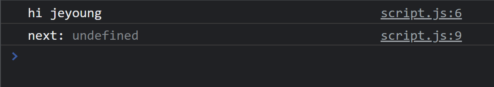

이것을 해결하기 위한 방법은 두가지가 있다.

- 첫번째로 es6 이전의 방식으로 새로운 변수에 this를 저장하는 것이다.
- 두번째로는 arrow 함수를 이용하는 것이다.

```js
const me = {
  name: "jeyoung",
  printName: function () {
    console.log("hi", this.name);

    const self = this;
    const nextLevel = function () {
      console.log("next:", self.name);
    };
    nextLevel();
  },
};

me.printName();
```

```js
const me = {
  name: "jeyoung",
  printName: function () {
    console.log("hi", this.name);

    const nextLevel = () => {
      console.log("next:", this.name);
    };
    nextLevel();
  },
};

me.printName();
```

## arguments 키워드

```js
const addExpr = function (a, b) {
  console.log(arguments);
  return a + b;
};

console.log(addExpr(1, 2));
```

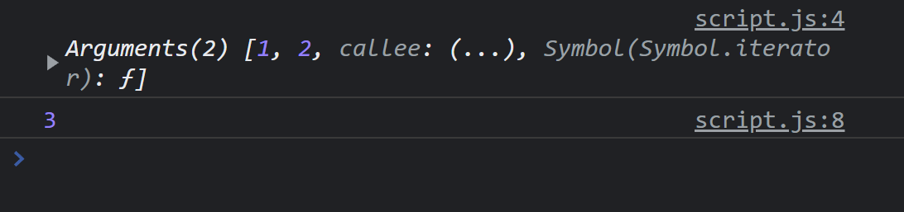
그리고 실제로 인수를 더 많이 넣었을 때 arguments 키워드를 이용하여 조회할 수 있다.

하지만 이는 arrow 함수에는 존재하지 않는다.
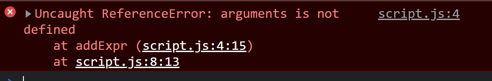
