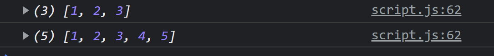

# 구조분해 할당

다음과 같은 문법을 사용하면 배열을 분해할 수 있다.

```js
const arr = [1, 2, 3];
const [x, y, z] = arr;
console.log(x, y, z);
```

```js
const restaurant = {
  name: "Classico Italiano",
  location: "Via Angelo Tavanti 23, Firenze, Italy",
  categories: ["Italian", "Pizzeria", "Vegetarian", "Organic"],
  starterMenu: ["Focaccia", "Bruschetta", "Garlic Bread", "Caprese Salad"],
  mainMenu: ["Pizza", "Pasta", "Risotto"],
};
```

위와 같은 객체가 있을 때 카테고리에서 이탈리안과 베지테리언을 뽑고 싶으면 다음과 같이 한다.

```js
const [first, , second] = restaurant.categories;
```

## swap

위에서 구한 first와 second를 swap하고 싶을 때 temp를 사용하지 않고 하는 방법이다.

```js
let [first, , second] = restaurant.categories;
[first, second] = [second, first];
```

## nested array

다음과 같이 중첩된 배열도 분해할 수 있다.

```js
const arr = [1, 2, [3, 4]];
const [x, , [y, z]] = arr;
```

## default value

```js
const arr = [1, 2];
const [x = 1, y = 1, z = 1] = arr;
```

# 객체 분해

다음과 같은 식으로 객체를 분해할 수 있다. 또한 이름도 지정해 줄 수 있다.

```js
const { name, categories: ctg } = restaurant;
console.log(name, ctg);
```

## default value

```js
const { name, categories: ctg, class: cls = [] } = restaurant;
console.log(name, ctg, cls);
```

## 객체 분해로 값 수정하기

다음과 같은 방식으론 값을 수정할 수가 없다. 왜냐하면 {}로 시작하면 js가 블록으로 인식하기 때문이다.  
이떄 ()로 감싸면 수정이 가능하다.

```js
let a = 111;
let b = 999;
const arr = {a: 20, b:25} ;
{a,b} = arr;
```

```js
let a = 111;
let b = 999;
const arr = { first: 20, second: 25 };
({ first: a, second: b } = arr);
console.log(a, b);
```

## nested object

```js
const restaurant = {
  openingHours: {
    thu: {
      open: 12,
      close: 22,
    },
    fri: {
      open: 11,
      close: 23,
    },
    sat: {
      open: 0, // Open 24 hours
      close: 24,
    },
  },
};
const {
  openingHours: {
    fri: { open, close },
  },
} = restaurant;
```

## 객체를 인자로 받는 함수

객체를 인자로 받았을 때 좋은 점 : 객체분해할당을 사용하면 인자와 다르게 순서가 상관이 없다.

```js
const restaurant = {
  name: "Classico Italiano",
  location: "Via Angelo Tavanti 23, Firenze, Italy",
  categories: ["Italian", "Pizzeria", "Vegetarian", "Organic"],
  starterMenu: ["Focaccia", "Bruschetta", "Garlic Bread", "Caprese Salad"],
  mainMenu: ["Pizza", "Pasta", "Risotto"],

  openingHours: {
    thu: {
      open: 12,
      close: 22,
    },
    fri: {
      open: 11,
      close: 23,
    },
    sat: {
      open: 0, // Open 24 hours
      close: 24,
    },
  },
  orderDelivery: function ({ starterIdx, mainIdx, name, address, time }) {
    const starter = this.starterMenu[starterIdx];
    const main = this.mainMenu[mainIdx];
    const message = `Order received! ${starter} and ${main} will be delivered to ${address} at ${time}`;
    console.log(message);
  },
};

restaurant.orderDelivery({
  starterIdx: 1,
  mainIdx: 1,
  name: "jeyoung",
  address: "seoul",
  time: "23:00",
});
```

# 스프레드 연산자

스프레드 연산자를 이용하면 배열을 분해할 수 있다. 문자열도 문자의 배열이므로 분해할 수 있다.

```js
const arr1 = [1, 2, 3, 4];
const arr2 = [5, 6, 7, 8];
const arr3 = [...arr1, ...arr2];
const newMenu = [...restaurant.mainMenu, ...restaurant.starterMenu];
```

스프레드 연산자(...)는 iterable에서 사용할 수 있다. iterable은 (array, map, set, strings) 가 있다. 객체(objects) 는 iterable이 아님.

## 함수에서 사용

```js
{orderPasta: function (ing1, ing2, ing3) {
    const message = `Pasta ing : ${ing1} ${ing2} ${ing3}`;
    console.log(message);
  },
}
  const PastaIng = ['a', 'b', 'c'];
restaurant.orderPasta(...PastaIng);

```

## 객체에서 사용하기

```js
const newRestaurant = { ...restaurant, founder: "jeyoung" };
```

# rest 연산자

배열에서 구조분해할당을 하고 남는 요소들을 집어넣을 수 있음. 하지만 중간에 집어넣지 않은 pasta는 others 에 들어가지못함.  
rest 연산자는 마지막에 한번만 쓸수 있다.

```js
const [pizza, , risotto, ...others] = [
  ...restaurant.mainMenu,
  ...restaurant.starterMenu,
];
console.log(pizza);
console.log(risotto);
console.log(others);
```

## 객체에서 사용하기

```js
const { sat, ...weekdays } = restaurant.openingHours;
console.log(weekdays);
```

## 함수에서 사용하기

```js
const add = function (...numbers) {
  console.log(numbers);
};
add(1, 2, 3);
add(1, 2, 3, 4, 5);
```

> 배열은 of  
> 객체는 in
> 

```js
const add = function (...numbers) {
  let sum = 0;
  for (const i of numbers) {
    sum += +i;
  }
  return sum;
};

console.log(add(1, 2, 3, 4, 5));
```

```js
const x = [12, 34, 56];
add(...x);
```

```js
{orderPizza : function(main, ...others){
    console.log(main);
    console.log(others);
  }}
```

# short circuiting (&& and ||) ★★

&& 연산자와 || 연산자는 boolean 타입만 사용할 수 있는것이 아니다. 모든 데이터 타입이 가능하고 모든 데이터 타입을 반환할 수 있다.

## || 연산자

처음으로 truthy 한 값이 나올때가지 뒤로 넘기다가 처음으로 truthy 한 값이 나오면 반환함, 아무것도 없으면 마지막 값을 반환

```js
console.log(null || undefined);
console.log(0 || "" || null || undefined || "hello");
```

다음과 같은 예시에서 guest는 정의되어 있지 않기 때문에 뒤의 값을 반환한다.

```js
const guestNum = restaurant.guest;
console.log(guestNum || 10);
```

하지만 실제로 손님이 한명도 없었을 경우 0을 집어 넣어야하는데 이는 오류를 발생시킨다. 해결책은 뒤쪽에 나온다.

## && 연산자

|| 연산자와 정확히 반대로 움직임: 처음으로 falsy 한 값이 나올때가지 뒤로 넘기다가 처음으로 falsy 한 값이 나오면 반환함, 아무것도 없으면 마지막 값을 반환
