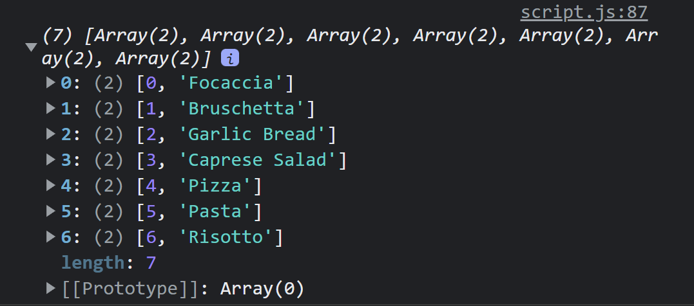

# 구조분해 할당

다음과 같은 문법을 사용하면 배열을 분해할 수 있다.

```js
const arr = [1, 2, 3];
const [x, y, z] = arr;
console.log(x, y, z);
```

```js
const restaurant = {
  name: "Classico Italiano",
  location: "Via Angelo Tavanti 23, Firenze, Italy",
  categories: ["Italian", "Pizzeria", "Vegetarian", "Organic"],
  starterMenu: ["Focaccia", "Bruschetta", "Garlic Bread", "Caprese Salad"],
  mainMenu: ["Pizza", "Pasta", "Risotto"],
};
```

위와 같은 객체가 있을 때 카테고리에서 이탈리안과 베지테리언을 뽑고 싶으면 다음과 같이 한다.

```js
const [first, , second] = restaurant.categories;
```

## swap

위에서 구한 first와 second를 swap하고 싶을 때 temp를 사용하지 않고 하는 방법이다.

```js
let [first, , second] = restaurant.categories;
[first, second] = [second, first];
```

## nested array

다음과 같이 중첩된 배열도 분해할 수 있다.

```js
const arr = [1, 2, [3, 4]];
const [x, , [y, z]] = arr;
```

## default value

```js
const arr = [1, 2];
const [x = 1, y = 1, z = 1] = arr;
```

# 객체 분해

다음과 같은 식으로 객체를 분해할 수 있다. 또한 이름도 지정해 줄 수 있다.

```js
const { name, categories: ctg } = restaurant;
console.log(name, ctg);
```

## default value

```js
const { name, categories: ctg, class: cls = [] } = restaurant;
console.log(name, ctg, cls);
```

## 객체 분해로 값 수정하기

다음과 같은 방식으론 값을 수정할 수가 없다. 왜냐하면 {}로 시작하면 js가 블록으로 인식하기 때문이다.  
이떄 ()로 감싸면 수정이 가능하다.

```js
let a = 111;
let b = 999;
const arr = {a: 20, b:25} ;
{a,b} = arr;
```

```js
let a = 111;
let b = 999;
const arr = { first: 20, second: 25 };
({ first: a, second: b } = arr);
console.log(a, b);
```

## nested object

```js
const restaurant = {
  openingHours: {
    thu: {
      open: 12,
      close: 22,
    },
    fri: {
      open: 11,
      close: 23,
    },
    sat: {
      open: 0, // Open 24 hours
      close: 24,
    },
  },
};
const {
  openingHours: {
    fri: { open, close },
  },
} = restaurant;
```

## 객체를 인자로 받는 함수

객체를 인자로 받았을 때 좋은 점 : 객체분해할당을 사용하면 인자와 다르게 순서가 상관이 없다.

```js
const restaurant = {
  name: "Classico Italiano",
  location: "Via Angelo Tavanti 23, Firenze, Italy",
  categories: ["Italian", "Pizzeria", "Vegetarian", "Organic"],
  starterMenu: ["Focaccia", "Bruschetta", "Garlic Bread", "Caprese Salad"],
  mainMenu: ["Pizza", "Pasta", "Risotto"],

  openingHours: {
    thu: {
      open: 12,
      close: 22,
    },
    fri: {
      open: 11,
      close: 23,
    },
    sat: {
      open: 0, // Open 24 hours
      close: 24,
    },
  },
  orderDelivery: function ({ starterIdx, mainIdx, name, address, time }) {
    const starter = this.starterMenu[starterIdx];
    const main = this.mainMenu[mainIdx];
    const message = `Order received! ${starter} and ${main} will be delivered to ${address} at ${time}`;
    console.log(message);
  },
};

restaurant.orderDelivery({
  starterIdx: 1,
  mainIdx: 1,
  name: "jeyoung",
  address: "seoul",
  time: "23:00",
});
```

# 스프레드 연산자

스프레드 연산자를 이용하면 배열을 분해할 수 있다. 문자열도 문자의 배열이므로 분해할 수 있다.

```js
const arr1 = [1, 2, 3, 4];
const arr2 = [5, 6, 7, 8];
const arr3 = [...arr1, ...arr2];
const newMenu = [...restaurant.mainMenu, ...restaurant.starterMenu];
```

스프레드 연산자(...)는 iterable에서 사용할 수 있다. iterable은 (array, map, set, strings) 가 있다. 객체(objects) 는 iterable이 아님.

## 함수에서 사용

```js
{orderPasta: function (ing1, ing2, ing3) {
    const message = `Pasta ing : ${ing1} ${ing2} ${ing3}`;
    console.log(message);
  },
}
  const PastaIng = ['a', 'b', 'c'];
restaurant.orderPasta(...PastaIng);

```

## 객체에서 사용하기

```js
const newRestaurant = { ...restaurant, founder: "jeyoung" };
```

# rest 연산자

배열에서 구조분해할당을 하고 남는 요소들을 집어넣을 수 있음. 하지만 중간에 집어넣지 않은 pasta는 others 에 들어가지못함.  
rest 연산자는 마지막에 한번만 쓸수 있다.

```js
const [pizza, , risotto, ...others] = [
  ...restaurant.mainMenu,
  ...restaurant.starterMenu,
];
console.log(pizza);
console.log(risotto);
console.log(others);
```

## 객체에서 사용하기

```js
const { sat, ...weekdays } = restaurant.openingHours;
console.log(weekdays);
```

## 함수에서 사용하기

```js
const add = function (...numbers) {
  console.log(numbers);
};
add(1, 2, 3);
add(1, 2, 3, 4, 5);
```

> 배열은 of  
> 객체는 in
> 

```js
const add = function (...numbers) {
  let sum = 0;
  for (const i of numbers) {
    sum += +i;
  }
  return sum;
};

console.log(add(1, 2, 3, 4, 5));
```

```js
const x = [12, 34, 56];
add(...x);
```

```js
{orderPizza : function(main, ...others){
    console.log(main);
    console.log(others);
  }}
```

# short circuiting (&& and ||) ★★

&& 연산자와 || 연산자는 boolean 타입만 사용할 수 있는것이 아니다. 모든 데이터 타입이 가능하고 모든 데이터 타입을 반환할 수 있다.

## || 연산자

처음으로 truthy 한 값이 나올때가지 뒤로 넘기다가 처음으로 truthy 한 값이 나오면 반환함, 아무것도 없으면 마지막 값을 반환

```js
console.log(null || undefined);
console.log(0 || "" || null || undefined || "hello");
```

다음과 같은 예시에서 guest는 정의되어 있지 않기 때문에 뒤의 값을 반환한다.

```js
const guestNum = restaurant.guest;
console.log(guestNum || 10);
```

하지만 실제로 손님이 한명도 없었을 경우 0을 집어 넣어야하는데 이는 오류를 발생시킨다. 해결책은 뒤쪽에 나온다.

## && 연산자

|| 연산자와 정확히 반대로 움직임: 처음으로 falsy 한 값이 나올때가지 뒤로 넘기다가 처음으로 falsy 한 값이 나오면 반환함, 아무것도 없으면 마지막 값을 반환

## nullish coalescing operator

|| 연산자와 사용법은 동일하지만 이전에 살펴봤듯이 0이나 '' 빈 문자열도 falsy value이기 때문에 || 연산자로 연산하면 뒤쪽에 있는 내용이 나왔다. guest의 숫자가 0이라고 표현하고 싶은데도 불구하고 말이다.
이 때 사용할 수 있는것이 nullish 연산자(??) 인데 , `null`과 `undefined`만 false로 취급한다.

## 복합 연산자

객체에 그 정보가 들어있는지 없는지 판단하여 값을 바꿔줄 수 있다. 다음과 같은 경우 복합연산자 `||=` 을 사용할 수도 있다.

```js
const rest1 = { name: "aaa", numOfGuest: 20 };
const rest2 = { name: "bbb", owner: "jeyoung" };

rest1.numOfGuest = rest1.numOfGuest || 10;
rest2.numOfGuest = rest2.numOfGuest || 10;

console.log(rest1, rest2);
```

```js
rest1.numOfGuest ||= 10;
rest2.numOfGuest ||= 10;
```


하지만 `numOfguest`가 0일 경우에 falsy 한 값이므로 ??=을 이용하면 해결 할 수 있다.

### &&= 복합 연산자

위와 같은 객체가 있을 때 `owner`에 대한 정보를 가려주고싶다 할 때 `&&=` 연산자를 사용할 수 있다.

```js
rest1.owner &&= "<anonymous>";
rest2.owner &&= "<anonymous>";
```

## challenge

> The team with the lower odd is more likely to win. Print to the console which
> team is more likely to win, without using an if/else statement or the ternary
> operator.

```js
team1 < team2 && console.log("Team1 is more likely to win");
team1 > team2 && console.log("Team2 is more likely to win");
```

# for loop

배열일 때는 for of
배열에서 for-of loop를 사용하면 다음과같이 모든 항목을 추출할 수 있다.

```js
const menu = [...restaurant.starterMenu, ...restaurant.mainMenu];
for (const item of menu) console.log(item);
```

하지만 이는 인덱스를 얻지 못하는 단점이 있는데, `menu.entries()`를 사용하면 인덱스 또한 얻을 수 있다.

```js
const menu = [...restaurant.starterMenu, ...restaurant.mainMenu];
console.log([...menu.entries()]);
```



또한 구조분해할당을 이용해서 인덱스를 뽑아낼 수 있다.

```js
for (const [idx, item] of menu.entries()) console.log(item);
```

# Enhanced Object Literals

세가지 방법
openingHours를 따로 빼서 객체에 추가할 수 있음, 이때 원래 이름이랑 객체에 넣을 이름이랑 같다면 그냥 객체명만 써도 됨

```js
const openingHours = {
  thu: {
    open: 12,
    close: 22,
  },
  fri: {
    open: 11,
    close: 23,
  },
  sat: {
    open: 0, // Open 24 hours
    close: 24,
  },
};
const restaurant = {
  name: "Classico Italiano",
  location: "Via Angelo Tavanti 23, Firenze, Italy",
  categories: ["Italian", "Pizzeria", "Vegetarian", "Organic"],
  starterMenu: ["Focaccia", "Bruschetta", "Garlic Bread", "Caprese Salad"],
  mainMenu: ["Pizza", "Pasta", "Risotto"],
  openingHours,
};
```

2. function 키워드를 생략해도 됨

```js
const restaurant = {
  name: "Classico Italiano",
  location: "Via Angelo Tavanti 23, Firenze, Italy",
  categories: ["Italian", "Pizzeria", "Vegetarian", "Organic"],
  starterMenu: ["Focaccia", "Bruschetta", "Garlic Bread", "Caprese Salad"],
  mainMenu: ["Pizza", "Pasta", "Risotto"],
  openingHours,

  orderDelivery({ starterIdx, mainIdx, name, address, time }) {
    const starter = this.starterMenu[starterIdx];
    const main = this.mainMenu[mainIdx];
    const message = `Order received! ${starter} and ${main} will be delivered to ${address} at ${time}`;
    console.log(message);
  },
  orderPasta(ing1, ing2, ing3) {
    const message = `Pasta ing : ${ing1} ${ing2} ${ing3}`;
    console.log(message);
  },
  orderPizza(main, ...others) {
    console.log(main);
    console.log(others);
  },
};
```

3. 객체 속성명을 동적으로 설정해 줄 수 있다.

```js
const weekdays = ["mon", "tue", "wed", "thu", "fri", "sat", "sun"];
const openingHours = {
  [weekdays[2]]: {
    open: 12,
    close: 22,
  },
  [weekdays[5]]: {
    open: 11,
    close: 23,
  },
  [`weekdays-${1 + 2}`]: {
    open: 0, // Open 24 hours
    close: 24,
  },
};
```

## optional chaining

객체.속성.속성. ... 에서 실제로 존재하지 않는값인지 아닌지 판단해주려면 if문을 사용하면 된다.

```js
if (restaurant.openingHours.mon) console.log(restaurant.openingHours.mon.open);
```

하지만 매번 이렇게 하는것은 너무 길기 때문에 optional chaining을 이용한다.

```js
for (const day of weekdays) {
  const open = restaurant.openingHours[day]?.open ?? "closed";
  console.log(`${day} open at ${open}`);
}
```


### 함수에서 optional chaining

```js
console.log(restaurant.order?.() ?? "no method");
```

# 객체 반복

`Object.keys()` 를 사용하면 key를 뽑아낼 수 있다.
`Object.values()` 사용하면 value 뽑아낼 수 있다.
`Object.entries()` 사용하면 [key,value] 를 뽑아낼 수 있다.

```js
const keys = Object.keys(restaurant);
const values = Object.values(restaurant);
const openDays = Object.entries(openingHours);
console.log(keys);
console.log(values);
for (const [day, { open, close }] of openDays) {
  console.log(`${day} open at ${open} and close at ${close}`);
}
```


## set => 배열에서 중복 제거

```js
const staff = ["waiter", "waiter", "waiter", "chef", "chef", "manager"];
const staffUnique = new Set(staff);
const staffUniqueArray = [...staffUnique];
staffUnique.add("costomer");
staffUnique.delete("waiter");
console.log(staffUnique.has("waiter"));
console.log(staffUnique);
console.log(staffUniqueArray);
console.log(staffUnique.size);
```


## map

key와 value 쌍을 만들 수 있다. set으로 설정하게 되는데 이때 set chain을 만들 수 있다.

```js
const rest = new Map();
rest
  .set("name", "jeyoung")
  .set("categories", ["Italian", "Pizzeria", "Vegetarian", "Organic"])
  .set("open", 9)
  .set("close", 23)
  .set(true, "We are open")
  .set(false, "We are close");

const time = 14;
console.log(rest.get(time > rest.get("open") && time < rest.get("close")));
```

다음과 같이 존재 여부를 확인 할 수도 있고, 값을 삭제할 수도 있습니다.

```js
console.log(rest.has("name"));
rest.delete("name");
console.log(rest);
```


배열도 key로 사용할 수 있다. 하지만 primitive 값과 reference 값은 같은 요소가 들어있어도 같은 값이 아니다.

```js
rest.set([1, 2], "test");
console.log(rest.has([1, 2])); // false
const arr = [1, 2, 3];
rest.set(arr, "test");
console.log(rest.has(arr)); //true
```

### querySelector를 mapping

놀랍게도 querySelector를 map의 key로 집어 넣을 수 있다...!

```js
rest.set(document.querySelector("h1"), "test");
console.log(rest);
```


## map iterator

다음과 같이 `openingHours`의 entries를 나타내면 이차원 배열의 형태로 나타난다.

그런데 map 또한 다음과 같이 이차원 배열로 초기화 할수가 있다.
그 밑과 같이 map을 활용할 수도 있다.
map을 다시 이차원 배열로 바꾸는 방법은 ...연산자를 활용하는 것이다.

```js
console.log(Object.entries(openingHours));
const question = new Map([
  ["question", "what is the best programming language in the world?"],
  [1, "C"],
  [2, "Java"],
  [3, "Javascript"],
  ["answer", 3],
  [true, "correct"],
  [false, "try again"],
]);
console.log(question.get("question"));
for (const [key, value] of question) {
  if (typeof key === "number") console.log(`Answer ${key}: ${value}`);
}
const answer = 3;

// const answer = Number(prompt('your answer? : '));
console.log(question.get(answer === question.get("answer")));

console.log([...question]);
console.log(question.entries());
console.log(question);
```

# 언제 무슨 자료구조를 사용해야 하는가 ?

데이터는 세곳에서 나온다.

1. 코딩 하다가 나오는 데이터 (우리가 쓰는, )
2. 사용자가 입력하는 데이터
3. api에서 가지고 오는 데이터 .
   그럴 때 데이터를 어디엔가 저장해야하는데 단순히 배열구조로 데이터를 저장해도 된다면 array/set에 저장하고 key:values 값을 할당해야 한다면 object/map이 적절하다.
   
   그리고 이제 array와 set을 나누어보자

- 중복이 허용 -> array
- 중복 허용x -> set
- 더 나은 성능 -> set
- 잦은 내부 조작 -> array

object와 map을 나누자면

- 더 나은 성능 -> map
- json 데이터 저장 -> object
- 메소드 this 키워드 이용 -> object
- key를 모든 타입으로 지정할 수 있다. -> map
  
