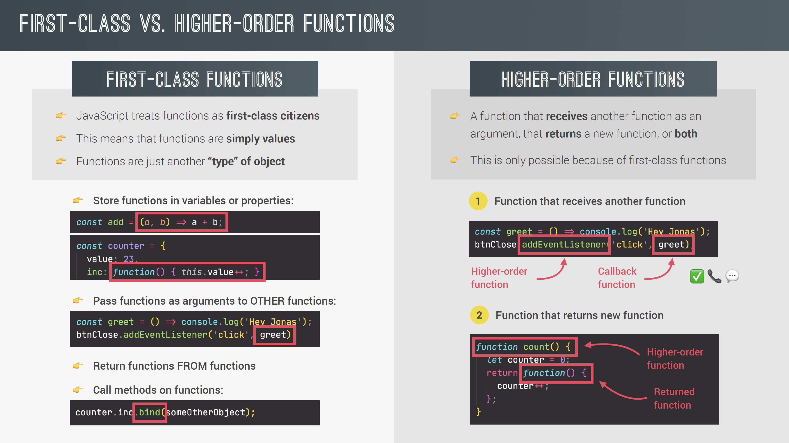

## Default Parameters

- 다음과 같이 default parameters 를 사용할 수 있다.
- 순서에 맞게 사용한다면 이전에 나왔던 인자를 사용하여 default parameter를 구성할 수도 있다.
- 중간을 건너뛰고 싶다면 `undefined`를 사용한다. `createBooking('LH123', undefined, 1000);`

```js
const bookings = [];

const createBooking = function (
  flightNum,
  numPassengers = 1,
  price = 199 * numPassengers
) {
  const booking = {
    flightNum,
    numPassengers,
    price,
  };
  console.log(booking);
  bookings.push(booking);
};
```

## How Passing Arguments Works: Values vs. Reference

함수에 primitive 타입의 변수를 인자로 쓴다면 함수 내부에서 외부의 값을 바꿀 수 없다.  
하지만 reference 타입의 변수를 인자로 사용한다면 함수내부의 조작이 외부에 영향을 미친다.  
이것은 C++ 에서 사용하는 call by reference라는 개념과는 **차이가 있다**  
javascript에는 기본적으로 call by reference라는 개념이 없다고 봐야한다.  
작동하는 원리는 다음과 같다.

이전에 primitive 타입과 reference 타입의 변수에 대해 다룬 적이 있다.  
단순히 함수 내부에서 새로운 변수에 복사하는 작업이 일어난다. 복사된 값은 value로서 복사가 되었지만  
heap에 있는 주소의 값이 복사가 된 것이지 reference가 전달된것은 아니라고 봐야한다.

_참고_  
Explanation

When we pass a primitive type as an argument on a function, the function makes a copy of the original value, and works with it.

When we pass an object as an argument on a function, the function makes a copy of the reference that points to the place of the memory where the object is stored. This copy is a value itself, is not a reference. Through this value, the original object can be modified from inside of a function.

Summary

- In programming languages, Arguments can be passed by value, or passed by reference.

- JavaScript works only passing by value.

- When we pass primitive values, the function works with a value, which is a copy of the original value.

- When we pass an object, the function works with a value, which is a copy of the reference that address to the spot in the memory where the original object is in the memory (still is not a reference).

```js
const flight = 'LH234';
const jonas = {
  name: 'Jonas Schmedtmann',
  passport: 24739479284,
};

const checkIn = function (flightNum, passenger) {
  flightNum = 'LH999';
  passenger.name = 'Mr. ' + passenger.name;

  if (passenger.passport === 24739479284) {
    alert('Checked in');
  } else {
    alert('Wrong passport!');
  }
};

checkIn(flight, jonas);
console.log(flight);
console.log(jonas);

Is the same as doing...
const flightNum = flight;
const passenger = jonas;

const newPassport = function (person) {
  person.passport = Math.trunc(Math.random() * 100000000000);
};

newPassport(jonas);
checkIn(flight, jonas);
```

## first class functions & higher order functions

함수는 객체이므로 값이다. 따라서 객체의 메소드도 사용할 수 있고, 어떤 함수의 반환값으로 사용될 수도 있다. 다시말해서 함수의 인자로 사용될 수도 있고 함수에서 함수를 반환할 수도 있다. 이를 higher order function이라고 한다.  
콜백 함수란 당장 실행하지않고 함수의 인자로 함수가 들어가는 것처럼 나중에 실행시키도록 넣어주는 함수값이다.



```js
// Functions Accepting Callback Functions
const oneWord = function (str) {
  return str.replace(/ /g, "").toLowerCase();
};

const upperFirstWord = function (str) {
  const [first, ...others] = str.split(" ");
  return [first.toUpperCase(), ...others].join(" ");
};

// Higher-order function
const transformer = function (str, fn) {
  console.log(`Original string: ${str}`);
  console.log(`Transformed string: ${fn(str)}`);

  console.log(`Transformed by: ${fn.name}`);
};

transformer("JavaScript is the best!", upperFirstWord);
transformer("JavaScript is the best!", oneWord);

// JS uses callbacks all the time
const high5 = function () {
  console.log("👋");
};
document.body.addEventListener("click", high5);
["Jonas", "Martha", "Adam"].forEach(high5);
```

콜백함수의 첫 번째 큰 장점은쉽게 더 재사용 가능하고 상호 연결된 부분으로 분할하거나 코딩할 수 있다는 것이다.
두번째로 콜백 함수가 높은 수준의 추상화를 만들어낸다.

## Functions Returning Functions

함수를 반환하는 함수
함수자체도 객체이기 때문에 반환할 수 있다고 했었다.  
그래서 다음과 같은 상황에서 함수를 반환할 수가 있다. 활용법은 아래와 같다.

```js
const greet = function (greeting) {
  return function (name) {
    console.log(`${greeting} ${name}`);
  };
};

const greeterHey = greet("Hey");
greeterHey("Jonas");
greeterHey("Steven");

greet("Hello")("Jonas");

// Challenge
const greetArr = (greeting) => (name) => console.log(`${greeting} ${name}`);

greetArr("Hi")("Jonas");
```

## The call and apply Methods

다음과 같은 객체가 있다고 해보자. (객체 안에서 메소드는 book: funtion(){...} 과 같은 형태도 괜찮지만 다음과 같은 방법이 더 현대적임)  
이 메소드는 airline과 iatacode와 bookings 배열이 있는 객체 안에서만 호출이 가능하다.

```js
const lufthansa = {
  airline: "Lufthansa",
  iataCode: "LH",
  bookings: [],
  // book: function() {}
  book(flightNum, name) {
    console.log(
      `${name} booked a seat on ${this.airline} flight ${this.iataCode}${flightNum}`
    );
    this.bookings.push({ flight: `${this.iataCode}${flightNum}`, name });
  },
};
lufthansa.book(239, "Jonas Schmedtmann");
lufthansa.book(635, "John Smith");
```

따라서 다른 객체를 만든 후에 다음과 같이 호출해도 효과가 없다.

```js
const eurowings = {
  airline: "Eurowings",
  iataCode: "EW",
  bookings: [],
};

const book = lufthansa.book;

// Does NOT work
// book(23, 'Sarah Williams');
```

메소드를 재사용하기 위한 다음과 같은 방법이 있다.

## Call method

다음과 같이 `객체.call()` 메소드를 사용하면 객체 안에서 꺼내온 메소드를 재사용할 수 있다.  
첫번째 인자는 어떤 객체에서 호출을 할 것인지, 즉 this 키워드의 대상이 어디인지 알려주는 것이고, 그 다음 인자는 메소드의 인자를 넣는다.

```js
book.call(eurowings, 23, "Sarah Williams");
console.log(eurowings);

book.call(lufthansa, 239, "Mary Cooper");
console.log(lufthansa);

const swiss = {
  airline: "Swiss Air Lines",
  iataCode: "LX",
  bookings: [],
};

book.call(swiss, 583, "Mary Cooper");
```

## Apply method

apply 메소드는 call과 굉장히 유사하다. 차이가 있다면 call 메소드는 객체 인자 뒤로 메소드의 인자를 하나씩 넣어주는데에 반해 apply 메소드는 메소드의 인자들을 배열에 넣어서 전달해준다.  
따라서 현대적인 js에서는 apply 메소드를 거의 사용하지 않는다.  
왜냐하면 spread 연산자를 이용하면 apply 메소드가 할 수 있는 동작은 call 메소드로도 할 수 있기 때문이다.

```js
const flightData = [583, "George Cooper"];
book.apply(swiss, flightData);
console.log(swiss);

book.call(swiss, ...flightData);
```

## The bind Method

다음과 같은 call 메소드가 있을 때, 이는 this 키워드를 수동으로 지정해주고 인자들을 넣어서 실행시키는 메소드이다.

```js
book.call(eurowings, 23, "Sarah Williams");
```

하지만 bind 메소드는 바로 실행시키지 않는다. 인자들의 배치는 기본적으로 call 메소드와 동일하지만 바로 실행시키지 않고 인자들을 묶는(bind) 역할을 한다.  
다음 예를 보면 this를 호출할 객체를 지정하고 다음번에 인자들을 넣는 모습을 볼 수가 있다.

```js
const bookEW = book.bind(eurowings);
const bookLH = book.bind(lufthansa);
const bookLX = book.bind(swiss);

bookEW(23, "Steven Williams");
```

그 외에도 인자를 지정해줄 수 있다. 인자들 순차적으로 지정해주면 된다.

```js
const bookEW23 = book.bind(eurowings, 23);
bookEW23("Jonas Schmedtmann");
bookEW23("Martha Cooper");
```

## With Event Listeners

이 bind 메소드는 `eventListener` 에서 중요하게 쓰인다. 객체에 `planes` 라는 변수를 추가하고, `buyPlane`이라는 메소드를 추가한다.  
그리고 `lufthansa.buyPlane();`를 호출한다면 잘 동작하겠으나 버튼에 연결해서 `document.querySelector(".buy").addEventListener("click", lufthansa.buyPlane);`와 같이 호출하려고 하면
문제가 생긴다. 아예 NaN이 출력되고, 첫번째 `console.log(this)` 는 버튼 객체를 출력한다.  
그 이유는 메소드를 호출한 객체가 버튼이기 때문이다. 따라서 이 문제를 해결하기 위해서는 bind 메소드를 사용하여 this를 호출할 객체를 수동으로 지정해 주어야한다.

```js
lufthansa.planes = 300;
lufthansa.buyPlane = function () {
  console.log(this);

  this.planes++;
  console.log(this.planes);
};
// lufthansa.buyPlane();
document.querySelector(".buy").addEventListener("click", lufthansa.buyPlane);
```

```js
//수정 후
document
  .querySelector(".buy")
  .addEventListener("click", lufthansa.buyPlane.bind(lufthansa));
```

## Partial application

위에서 봤던 것과 같이 bind 메소드를 사용하면 인자를 부분 지정해줄 수 있다. 그리고 이 방법은 함수를 반환하는 함수를 통해서도 똑같이 구현해낼 수 있다.

```js
const addTax = (rate, value) => value + value \* rate;
console.log(addTax(0.1, 200));

const addVAT = addTax.bind(null, 0.23);
// addVAT = value => value + value \* 0.23;

console.log(addVAT(100));
console.log(addVAT(23));

const addTaxRate = function (rate) {
  return function (value) {
    return value + value * rate;
  };
};
const addVAT2 = addTaxRate(0.23);
console.log(addVAT2(100));
console.log(addVAT2(23));
```

# challenge 1

회고 :

- 배열을 출력할 때, join 메소드를 이용하면 자유롭게 출력할 수 있다.
- typedef ... 에러핸들링 해야한다.
- addEventListener 사용할 땐 bind 사용해야 한다.
- 새로운 배열 출력하고 싶으면 call 메소드를 사용하되 새로운 객체를 만들어서 사용한다.

```js
const poll = {
  question: "What is your favourite programming language?",
  options: ["0: JavaScript", "1: Python", "2: Rust", "3:C++"],
  // This generates [0, 0, 0, 0]. More in the next section!
  answers: new Array(4).fill(0),
  displayResults(type = "string") {
    if (type === "string") {
      console.log(`Poll results are ${this.answers}.`);
    } else if (type === "array") {
      console.log(this.answers);
    }
  },
  registerNewAnswer() {
    const answer = Number(
      prompt(`${this.question}\n${this.options.join("\n")}`)
    );
    typeof answer === "number" &&
      +answer < this.options.length &&
      this.answers[+answer]++;
    this.displayResults();
    this.displayResults("string");
  },
};

document
  .querySelector(".poll")
  .addEventListener("click", poll.registerNewAnswer.bind(poll));

const data1 = [1, 2, 3, 4, 5, 6];
poll.displayResults.call({ answers: data1 });
poll.displayResults.call({ answers: data1 }, "array");
```

## Immediately Invoked Function Expression(IIFE)

함수로 만들어서 실행시키면 재사용이가능하다.  
하지만 익명함수를 만든다면 실행할 수가 없는데 이때 `(function(...))();` 처럼 괄호로 감싼다면 실행시킬 수 있다.  
딱 한번만 실행시키는 함수인 것이다. 이는 스코프 내부에서 변수를 보호하기 위해 만들어졌다.

```js
const runOnce = function () {
  console.log("This will never run again");
};
runOnce();

// IIFE
(function () {
  console.log("This will never run again");
  const isPrivate = 23;
})();

// console.log(isPrivate);

(() => console.log("This will ALSO never run again"))();

{
  const isPrivate = 23;
  var notPrivate = 46;
}
// console.log(isPrivate);
console.log(notPrivate);
```

# Closures


다음 코드와 같이 `secureBooking` 이라는 실행컨텍스트가 사라져도 booker를 실행하면 passengerCount라는 변수에 접근할 수가 있다.  
이는 클로저라고 하는 함수의 속성이다.  
함수가 태어난 곳을 기억하고 스코프안에서 해당 변수가 없을때 스코프 체인보다도 클로저를 먼저 확인하게 된다. 다시말해서 `passengerCount`라는 전역변수가 있더라도 클로저의 변수를 먼저 찾게 된다는 것이다.  
`console.dir(booker);`을 하면 스코프 체인을 볼 수가 있따.
클로저는 완전히 자동으로 생성되고 명시적으로 액세스할 수 있는 방법이 없습니다.
우리가 접근할 수 있는 객체와 같은 형태가 아니므로 클로저에 도달할 수 없습니다
다만 클로저가 발생하는 것을 관찰할 수 있습니다.

```js
const secureBooking = function () {
  let passengerCount = 0;

  return function () {
    passengerCount++;
    console.log(`${passengerCount} passengers`);
  };
};

const booker = secureBooking();

booker();
booker();
booker();

console.dir(booker);
```

## closer 예시

### Example 1

let 변수 f는 g함수안에서 정의가 된다. 이후 g 함수를 실행시킨 후에 f 를 실행시키면 g안에서의 변수 a=23을 기억하고 f();는 46을 반환한다.  
자동으로 클로저가 생성되었고, f가 태어난곳을 기억하여 변수를 찾은것이다.  
h함수를 통해 f를 변경시키면 새로운 클로저가 생기고 이전에 있던 클로저는 잃어버리게 된다.

```js
let f;

const g = function () {
  const a = 23;
  f = function () {
    console.log(a * 2);
  };
};

const h = function () {
  const b = 777;
  f = function () {
    console.log(b * 2);
  };
};

g();
f();
console.dir(f);

// Re-assigning f function
h();
f();
console.dir(f);
```

### Example 2

대표적인 예로 setTimeout 함수가 클로저를 설명하기 좋다.  
왜냐하면 setTimeout 를 호출하는 함수가 끝난 후에 setTimeout 안에 있던 콜백 함수가 실행되어야하기 때문이다.  
따라서 setTimeout은 클로저가 형성되어있고 함수가 종료된 이후에도 많은 변수를 찾아서 함수를 실행시킬 수가 있다.

```js
const boardPassengers = function (n, wait) {
  const perGroup = n / 3;

  setTimeout(function () {
    console.log(`We are now boarding all ${n} passengers`);
    console.log(`There are 3 groups, each with ${perGroup} passengers`);
  }, wait * 1000);

  console.log(`Will start boarding in ${wait} seconds`);
};

const perGroup = 1000;
boardPassengers(180, 3);
```

### Example 3

IIFE를 이용하여 header 변수를 없앤 경우에도 이벤트리스너를 등록해놓는다면 추후 사용할 수있다.  
이것도 클로저로 설명이 가능하다.

```js
(function () {
  const header = document.querySelector("h1");
  header.style.color = "red";
  header.addEventListener("click", () => {
    header.style.color = "blue";
  });
})();
```
