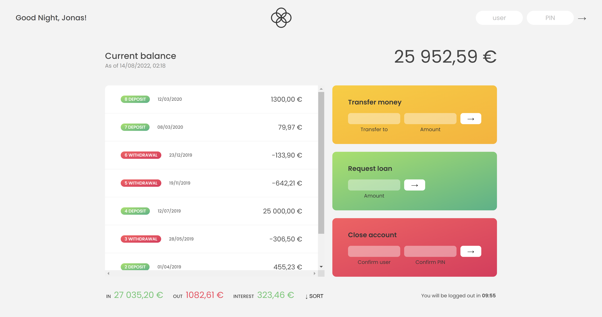
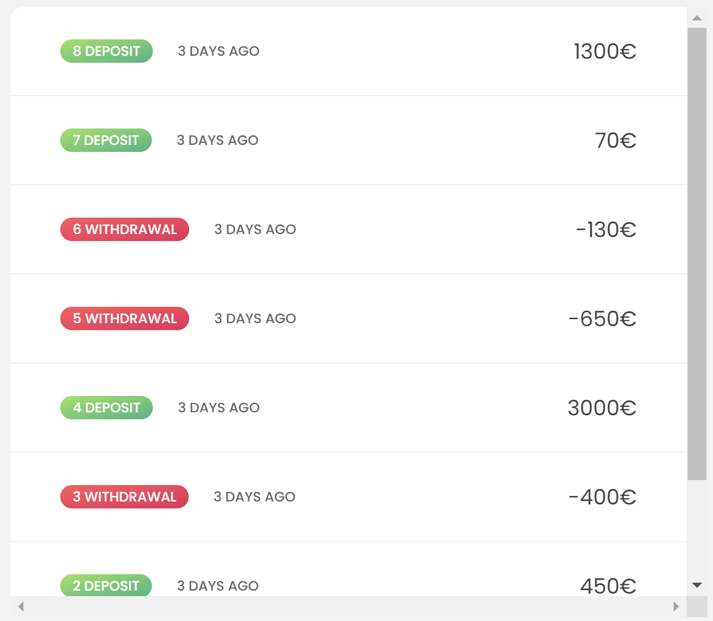
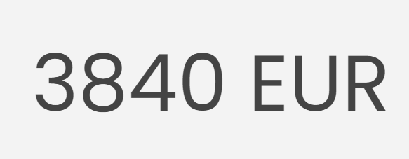
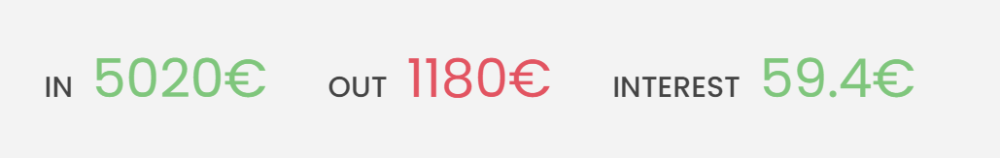

# Bankist App




## 첫번째, movement 만들기



1. forEach 메소드를 사용한다.
2. 템플릿 리터럴을 사용해서 요소를 만든다
3. `insertAdjacentHTML`을 이용하여 요소를 추가한다.
4. 초반에 컨테이너를 초기화한다 (`innerHTML`)

```js
const displayMovements = function (movement) {
  containerMovements.innerHTML = "";
  movement.forEach((mov, i) => {
    const type = mov > 0 ? "deposit" : "withdrawal";
    const html = `
  <div class="movements__row">
    <div class="movements__type movements__type--${type}"> ${
      i + 1
    } ${type}</div>
    <div class="movements__date">3 days ago</div>
    <div class="movements__value">${mov}€</div>
  </div>`;
    containerMovements.insertAdjacentHTML("afterbegin", html);
  });
};
displayMovements(account1.movements);
```

## 두번째 balance 구하기 (reduce 이용)



```js
const displayCalcBalance = function (arr) {
  const balance = arr.reduce((acc, mov) => acc + mov, 0);
  labelBalance.textContent = `${balance} EUR`;
};
displayCalcBalance(account1.movements);
```

## 세번째 요약화면 만들기



```js
const calcDisplaySummary = function (acc) {
  const incomes = acc.movements
    .filter((mov) => mov > 0)
    .reduce((acc, mov) => acc + mov, 0);
  labelSumIn.textContent = `${incomes}€`;

  const out = acc.movements
    .filter((mov) => mov < 0)
    .reduce((acc, mov) => acc + mov, 0);
  labelSumOut.textContent = `${Math.abs(out)}€`;

  const interest = acc.movements
    .filter((mov) => mov > 0)
    .map((deposit) => (deposit * acc.interestRate) / 100)
    .filter((int, i, arr) => {
      // console.log(arr);
      return int >= 1;
    })
    .reduce((acc, int) => acc + int, 0);
  labelSumInterest.textContent = `${interest}€`;
};
```

## 네번째 로그인 하기

1. form 전송 막기 -> preventDefault();
2. id 필드와 데이터베이스의 아이디와 일치하면 그 계정에 대한 정보를 currentAccount에 저장하기(find 메소드 이용)
3. pin 필드와 currentAccount의 pin이 일치하면 로그인 하도록 만들기
4. 로그인 화면 업데이트
   - 이전까지 만들어놓았던 함수들 이용
   - id 필드와 pin 필드 초기화
   - appContainer 보이게 만들기 위해서 opacity = 100으로 설정

```js
btnLogin.addEventListener("click", (e) => {
  e.preventDefault();
  currentAccount = accounts.find((acc) => {
    return inputLoginUsername.value === acc.username;
  });
  if (currentAccount?.pin === Number(inputLoginPin.value)) {
    //log in
    labelWelcome.textContent = `Welcome Back, ${
      currentAccount.owner.split(" ")[0]
    }`;
    calcDisplaySummary(currentAccount);
    displayMovements(currentAccount.movements);
    displayCalcBalance(currentAccount.movements);
    inputLoginUsername.value = "";
    inputLoginPin.value = "";
    containerApp.style.opacity = 100;
  }
});
```
