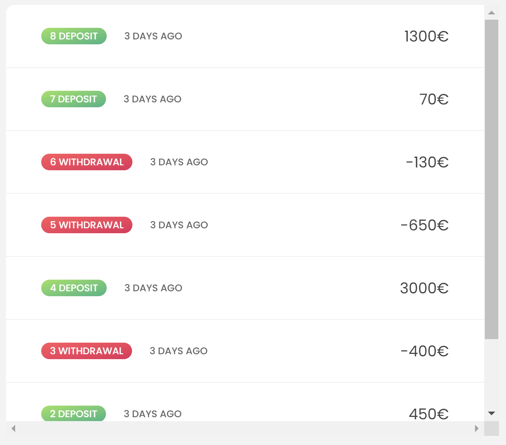
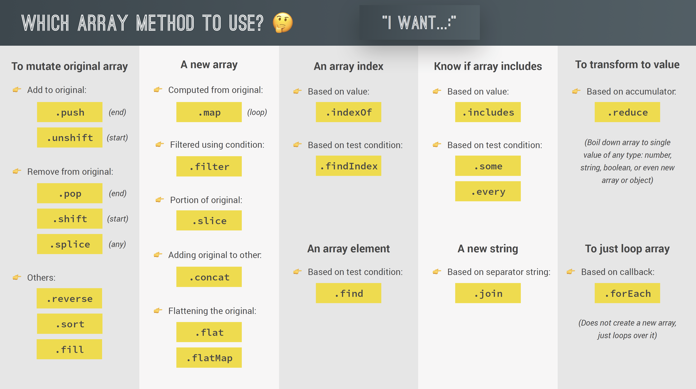

[TOC]

## Simple Array Methods

```js
let arr = ["a", "b", "c", "d", "e"];
```

## SLICE

배열을 자르는 함수이다. 원본 배열을 변형하지 않으며, 첫번째 인덱스 포함 두번째 인덱스포함x 이전까지 자른다.  
-1... 등 음수값을 이용하면 더 편리하게 사용할 수 있따.

```js
console.log(arr.slice(2));
console.log(arr.slice(2, 4));
console.log(arr.slice(-2));
console.log(arr.slice(-1));
console.log(arr.slice(1, -2));
console.log(arr.slice());
console.log([...arr]);
```

## SPLICE

배열을 자르는 함수이다. 원본 배열을 변형한다. 첫번째 인덱스 부터 n개의 요소를 자른다.  
-1... 등 음수값을 이용하면 더 편리하게 사용할 수 있따.

```js
console.log(arr.splice(2));
arr.splice(-1);
console.log(arr);
arr.splice(1, 2);
console.log(arr);
```

## REVERSE

배열을 거꾸로 하는 메소드이다. 원본 배열을 변형한다.

```js
arr = ["a", "b", "c", "d", "e"];
const arr2 = ["j", "i", "h", "g", "f"];
console.log(arr2.reverse());
console.log(arr2);
```

## CONCAT

배열을 붙이는 메소드이다. 원본 배열을 변형하지 않는다. 스프레드 연산자로도 구현할 수 있다.

```js
const letters = arr.concat(arr2);
console.log(letters);
console.log([...arr, ...arr2]);
```

## JOIN

배열을 하나의 문자열로 만들어주는 메소드이다.

```js
console.log(letters.join(" - "));
```

## 메소드의 새로운 기능 at method

원래 배열의 요소에 접근 할 때 [] 괄호를 사용하였다.  
하지만 마지막 요소에 접근해야할 때는 배열의 길이를 알아야만 arr.length -1 인덱스에 접근할 수 있었다.  
하지만 at 메소드가 나오면서 arr.at(-1) 로도 접근이 가능하게 되었다.

```js
const arr = [23, 11, 64];
console.log(arr[0]);
console.log(arr.at(0));

// getting last array element
console.log(arr[arr.length - 1]);
console.log(arr.slice(-1)[0]);
console.log(arr.at(-1));

console.log("jonas".at(0));
console.log("jonas".at(-1));
```

## Looping Arrays: forEach

다음과 같은 배열이 있다고 했을 때 배열을 한바퀴 돌면서 작업할 수 있다.  
이전에 봤었던 for of 구문을 이용할 수 있다. for of 구문을 이용할 경우 인덱스를 movements.entries() 를 이용해 찾을 수 있다.  
이와 같은 작업을 forEach에서도 할 수 있다.  
forEach 메소드의 콜백함수 인자의 순서는 다음과 같다. `(요소, 인덱스, 전체배열)`

둘을 각각 언제 사용하느냐는 개인의 취향이지만 차이점이 있다면 forEach 구문은 continue와 break같은 기능을 사용할 수 없다.

```js
const movements = [200, 450, -400, 3000, -650, -130, 70, 1300];

// for (const movement of movements) {
for (const [i, movement] of movements.entries()) {
  if (movement > 0) {
    console.log(`Movement ${i + 1}: You deposited ${movement}`);
  } else {
    console.log(`Movement ${i + 1}: You withdrew ${Math.abs(movement)}`);
  }
}

console.log("---- FOREACH ----");
movements.forEach(function (mov, i, arr) {
  if (mov > 0) {
    console.log(`Movement ${i + 1}: You deposited ${mov}`);
  } else {
    console.log(`Movement ${i + 1}: You withdrew ${Math.abs(mov)}`);
  }
});
// 0: function(200)
// 1: function(450)
// 2: function(400)
// ...
```

## forEach With Maps and Sets

forEach 메소드는 map이나 set에서도 사용할 수 있다.  
map에서 forEach에 들어가는 인자는 value, key ,map 순서이다.

```js
// Map
const currencies = new Map([
  ["USD", "United States dollar"],
  ["EUR", "Euro"],
  ["GBP", "Pound sterling"],
]);

currencies.forEach(function (value, key, map) {
  console.log(`${key}: ${value}`);
});
```

하지만 set에서는 key가 존재하지 않는다. 따라서 두번째 인자는 없애도 되지만 통일성을 위해서 첫번째 인자와 두번째인자는 value로 설정되어 있다.

```js
// Set
const currenciesUnique = new Set(['USD', 'GBP', 'USD', 'EUR', 'EUR']);
console.log(currenciesUnique);
currenciesUnique.forEach(function (value, _, map) {
  console.log(`${value}: ${value}`);
});
*/
```

## challenge 1

두 배열이 있는데 첫번째 배열의 1, -1, -2 요소는 강아지가 아니고 고양이이다.  
예를들어 다음과 같은 두 배열이 있으면 julia의 3,12,7살의 생물체는 고양이가 되는것이다.  
이때 두 배열을 인자로 받아서 3살 이상이면 adult, 미만이면 puppy를 출력하는 프로그램을 짜보자.

```js
const dogsJulia = [3, 5, 2, 12, 7];
const dogsKate = [4, 1, 15, 8, 3];
```

1. `.slice()` 를 이용해서 얕은 복사본 만들기
2. `splice()`를 이용해서 배열 자르기
3. `concat()`을 이용해서 두 배열 붙이기
4. `forEach`를 이용해서 출력하기

```js
const dogsJulia = [3, 5, 2, 12, 7];
const dogsKate = [4, 1, 15, 8, 3];

const displayDog = (arr1, arr2) => {
  const arrcopy1 = arr1.slice(1, -2);
  const res = arrcopy1.concat(arr2);
  res.forEach((mov, idx) => {
    if (mov >= 3) {
      console.log(`Dog number ${idx + 1} is an adult, and is ${mov} years old`);
    } else {
      console.log(`Dog number ${idx + 1} is still a puppy 🐶`);
    }
  });
};
displayDog(dogsJulia, dogsKate);
```

# map, filter, reduce

## The map Method

map 메소드와 foreach 메소드는 배열을 순회하는 같은 역할을 수행한다.  
콜백함수의 인자는 foreach와 마찬가지로 [item, idx, arr] 이다.  
forEach와 map의 차이는 다음과 같다.  
forEach는 원본배열을 수정할수 있다. 이를 side effect라고 부르며, 또한 return 값은 언제나 undefined이다.  
반면에 map 메소드는 새로운 배열을 만들어내고 원본배열을 수정할 수 없으며 return을 지정할 수있다.

```js
const eurToUsd = 1.1;
const movementsUSD = movements.map((mov) => mov * eurToUsd);

console.log(movements);
console.log(movementsUSD);

const movementsUSDfor = [];
for (const mov of movements) movementsUSDfor.push(mov * eurToUsd);
console.log(movementsUSDfor);

const movementsDescriptions = movements.map(
  (mov, i) =>
    `Movement ${i + 1}: You ${mov > 0 ? "deposited" : "withdrew"} ${Math.abs(
      mov
    )}`
);
console.log(movementsDescriptions);
```

## forEach vs map

### 이름을 인자로 받아서 받아서 이니셜별명 만들기

1. 전부 소문자로 만들어줌
2. 공백을 기준으로 split
3. 첫글자만 땀 (이때 map이 쓰임)
4. join으로 합쳐줌

```js
const username = fullname
  .toLowerCase()
  .split(" ")
  .map((name) => name[0])
  .join("");
```

그리고 각 사람의 이니셜을 객체 안에 추가하고 싶다면 원본 배열을 바꿀수 있는 forEach 메소드를 사용한다.

```js
const createUsernames = function (accs) {
  accs.forEach(function (acc) {
    acc.username = acc.owner
      .toLowerCase()
      .split(" ")
      .map((name) => name[0])
      .join("");
  });
};
createUsernames(accounts);
```

## filter method

특정 배열에서 원하는 정보만 추릴때 사용할수 있는 메소드이다.  
boolean을 반환해서 조건에 맞는 요소들만 추출해낸다.  
여타 메소드와 같이 인자는 [item, idx, arr] 이다.

```js
const withdrawals = movements.filter((mov) => {
  return mov < 0;
});
console.log(withdrawals);
```

## The reduce Method

reduce 메소드는 배열의 요소를 하나의 값으로 줄이는 역할을 한다.  
예를 들어 sum을 구하거나 max 값을 구할 때 쓰인다. 다른 메소드들과 다르게 인자가 하나 더추가되는데  
여태가지의 메소드들은 [item, idx, arr] 이었다면 reduce 메소드는 [acc,item, idx,arr] 이다.  
그리고 `acc`의 초기값을 다음과 같은 형태로 지정해 준다.  
`const arr = base.reduce(()=>{}, 초기값);`

```js
console.log(movements);

const balance = movements.reduce(function (acc, cur, i, arr) {
  console.log(`Iteration ${i}: ${acc}`);
  return acc + cur;
}, 0);
console.log(balance);

let balance2 = 0;
for (const mov of movements) balance2 += mov;
console.log(balance2);
```

### Maximum value

```js
const max = movements.reduce((acc, mov) => {
  if (acc > mov) return acc;
  else return mov;
}, movements[0]);
console.log(max);
*/
```

## challenge 2

강아지들의 나이를 배열로 받는다. 사람의 나이로 환산한다. 사람나이로 환산했을 때 18살 미만의 개들은 배열에서 빼고 그 평균을 구한다.  
average 편하게 구하는 꿀팁  
sum을 구한다음에 갯수로 나누는 방법은 다음과 같다. (2+4+8)  
하지만 이미 배열의 길이를 알고 있다면 분배법칙을 통해서 2/3 + 4/3 + 8/3 을 하면 되고 reduce 메소드를 활용하기 더 편리해진다.

```js
const data1 = [5, 2, 4, 1, 15, 8, 3];
const calcDtoH = function (age) {
  if (age <= 2) return 2 * age;
  else return 16 + age * 4;
};

const calcAverageHumanAge = function (arr) {
  const age = arr
    .map((age) => {
      return calcDtoH(age);
    })
    .filter((age) => age >= 18)
    .reduce((acc, age, idx, arr) => acc + age / arr.length, 0);
  return age;
};
console.log(calcAverageHumanAge(data1));
```

## chaining

1. chaining 을 너무 남발해서는 안된다. 배열이 클 때 퍼포먼스의 문제를 일으킬 수 있다. map만 써도 다 할 수 있다.
2. splice, reverse와 같은 원본 배열을 변형시키는 메소드는 chaining 하지 않는게 좋다.
3. chaining 을 사용하면 디버깅하기 어렵다. 어느 chain에서 잘못되었는지 모르기 때문이다. 이럴 때에는 [item,idx,arr]에서 arr을 중간에 출력하는 방식을 이용한다.

## The find Method

배열에서 콜백함수의 조건에 맞는 요소를 전달

```js
const firstWithdrawal = movements.find((mov) => mov < 0);
console.log(movements);
console.log(firstWithdrawal);

console.log(accounts);

const account = accounts.find((acc) => acc.owner === "Jessica Davis");
console.log(account);
```

## some and every

includes 메소드를 사용하면 단순히 배열안에 어떤 값과 `일치` 하는지 여부를 bool 형태로 반환한다.  
하지만 조건을 만들어서 boolean형태로 반환하기 위해선 some과 every 메소드를 사용하면 된다.  
some 메소드는 조건에 맞는 요소가 하나라도 있으면 true를 반환하고  
every 메소드는 조건에 모두 맞아야 true를 반환한다.
콜백함수를 항상 익명함수로 작성할 필요는 없다.

```js
// EQUALITY
console.log(movements.includes(-130));

// SOME: CONDITION
console.log(movements.some((mov) => mov === -130));

const anyDeposits = movements.some((mov) => mov > 0);
console.log(anyDeposits);

// EVERY
console.log(movements.every((mov) => mov > 0));
console.log(account4.movements.every((mov) => mov > 0));

// Separate callback
const deposit = (mov) => mov > 0;
console.log(movements.some(deposit));
console.log(movements.every(deposit));
console.log(movements.filter(deposit));
```

## flat and flatMap

중첩 배열안에서 중첩된 요소들을 꺼내고 싶을 때, flat이라는 메소드를 사용한다.  
flat()을 한번 사용하게되면 1수준의 배열들이 나오게된다. flat(2)를 호출하면 2수준까지 끌어낼 수 있다.  
실사용례는 아래와 같다.  
여러 배열들을 한군데에 넣고 배열을 풀어서 합을 구하는 로직인데, map을 써서 배열을 묶고 flat으로 푼다.  
그런데 이를 한번에 해주는 메소드가 있는데 flatMap이다. 하지만 이 메소드는 1수준의 배열만 flat시킬 수 있다.

```js
const arr = [[1, 2, 3], [4, 5, 6], 7, 8];
console.log(arr.flat());

const arrDeep = [[[1, 2], 3], [4, [5, 6]], 7, 8];
console.log(arrDeep.flat(2));

// flat
const overalBalance = accounts
  .map((acc) => acc.movements)
  .flat()
  .reduce((acc, mov) => acc + mov, 0);
console.log(overalBalance);

// flatMap
const overalBalance2 = accounts
  .flatMap((acc) => acc.movements)
  .reduce((acc, mov) => acc + mov, 0);
console.log(overalBalance2);
```

## Sorting Arrays

그냥 sort 메소드를 사용하면 (콜백 함수없이) 알파벳 오름차순으로 정렬을 한다.  
숫자를 넣어도 마찬가지로 문자열을 취급하는 것처럼 정렬을 한다.  
숫자를 정렬하고 싶으면 콜백함수를 만들어야하는데, return 값이 양수면 swap 하고 음수면 그대로 두는 방식이다.  
인자는 a, b를 받는다. 만약 오름차순으로 정렬하고 싶다면 a,b 가 있을 때 b가 더 커야한다. 따라서 `a < b` 일때는 -1을 리턴해주고 `a > b` 일 때는 1을 반환해주면 된다. 간단하게 `a-b`를 반환하는 방법도 있다.

```js
// Strings
const owners = ["Jonas", "Zach", "Adam", "Martha"];
console.log(owners.sort());
console.log(owners);

// Numbers
console.log(movements);

// return < 0, A, B (keep order)
// return > 0, B, A (switch order)

// Ascending
// movements.sort((a, b) => {
//   if (a > b) return 1;
//   if (a < b) return -1;
// });
movements.sort((a, b) => a - b);
console.log(movements);

// Descending
// movements.sort((a, b) => {
//   if (a > b) return -1;
//   if (a < b) return 1;
// });
movements.sort((a, b) => b - a);
console.log(movements);
```

## More Ways of Creating and Filling Arrays

`new Array()` 를 사용하여 새로운 array를 만들 수 있다.  
`new Array(1,2,3)` 이면 [1,2,3] 의 배열이 만들어지지만 `new Array(7)`은 7칸의 빈 배열을 만들어낸다.  
그 빈 배열은 fill 메소드로 채울 수 있다. 물론 비어있지 않아도 채울 수있다.
`array.fill(1,3,5)`는 1로 [3,5) 칸을 채우겠다는 뜻이다.

```js
const arr = [1, 2, 3, 4, 5, 6, 7];
console.log(new Array(1, 2, 3, 4, 5, 6, 7));

// Emprty arrays + fill method
const x = new Array(7);
console.log(x);
// console.log(x.map(() => 5));
x.fill(1, 3, 5);
x.fill(1);
console.log(x);

arr.fill(23, 2, 6);
console.log(arr);
```

## Array.from

배열을 만드는 더 좋은 방법은 Array.from을 사용하는 것이다.
첫번째인자로는 iterable을 받고 두번째 인자로는 콜백 함수를 받는다. 다음 보이는 예시처럼 {length:7} 을 첫번째 인자로 넣으면 길이가 7인 배열이 생성된다.  
그리고 콜백함수가 반환하는 값으로 채워준다. 콜백함수의 인자는 map과 같다. (cur, idx, arr) 이다.

```js
const y = Array.from({ length: 7 }, () => 1);
console.log(y);

const z = Array.from({ length: 7 }, (_, i) => i + 1);
console.log(z);
```

### iterable


위와같은 사진에서 movement의 값들이 배열로 저장되어있지 않다면 querySelector와 Array.from을 이용해서 배열을 만들 수 있다.  
Array.from()의 첫번째 인자로 `NodeList`인 querySelectorAll을 집어넣어준다.  
그리고 이후 map을 사용해서 그 값들을 배열에 넣어도 되지만 두번째 인자인 콜백함수를 통해서도 가능하다.

```js
labelBalance.addEventListener("click", function () {
  const movementsUI = Array.from(
    document.querySelectorAll(".movements__value"),
    (el) => Number(el.textContent.replace("€", ""))
  );
  console.log(movementsUI);

  const movementsUI2 = [...document.querySelectorAll(".movements__value")];
});
```


