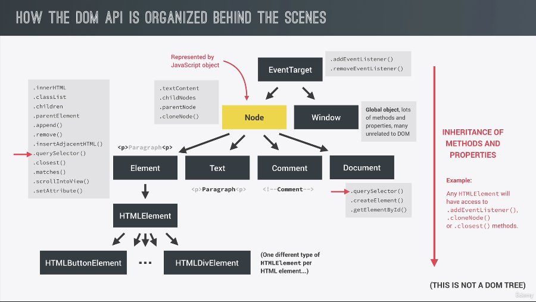
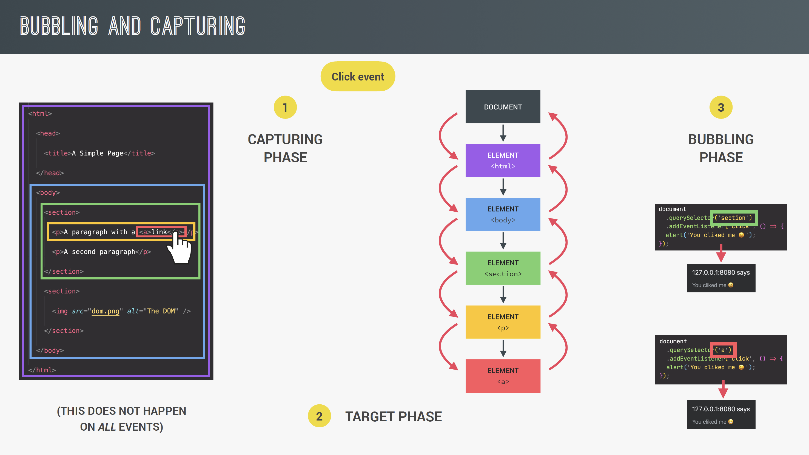

## 버튼을 누르면 최상단으로 이동하는 문제

`href='#'` 으로 되어있어서 버튼을 클릭하면 최상단으로 이동하게 됨.  
이를 막기 위해서 openmodal 함수에서 `preventDefault`를 해주면 해결.

```js
<li class='nav__item'>
  <a class='nav__link nav__link--btn btn--show-modal' href='#'>
    Open account
  </a>
</li>
```

## openModal 전부에 함수달기

```js
const btnsOpenModal = document.querySelectorAll('.btn--show-modal');
```

```js
btnsOpenModal.forEach((btn) => {
  btn.addEventListener('click', openModal);
});
```

## Dom Api behind the scenes


DOM API가 이러한 다양한 유형의 노드로 나뉩니다.  
노드의 유형에 따라 다른 속성과 메서드에 액세스할 수 있습니다.  
그리고 그들 중 일부는 더 많은 속성과 메서드를 상속받기도 합니다.

요소 또는 문서의 addEventListener 메서드가 실제로 작동하는 이유  
노드 유형의 부모인 EventTarget이라는 특수한 노드 유형이 있기 때문입니다.
이것으로 상속 덕분에, 모든 단일 유형의 노드에서 addEventListener를 호출할 수 있습니다.

## 186. Selecting, Creating, and Deleting Elements

querySelector : NodeList 반환
getElementsByTagName, getElementsByClassName : HTMLCollection 반환

NodeList의 경우 저장할 때 담은 것이 유지됨  
HTMLCollection은 삭제 되면 배열에 삭제 된 것이 반영됨

- prepend
- append
- before
- after
- cloneNode(true)
- remove

## 187. Styles, Attributes and Classes

> style

element.style : 인라인 스타일을 지정해 줄 수 있음  
하지만 클래스에 있는 스타일을 가지고 올 수가 없다.
`getComputedStyle($message).color` 처럼 하면 가지고 올 수 있음

```js
message.style.height =
  Numer.parseFloat(getComputedStyle(message).height, 10) + 30 + 'px';
```

```js
document.documentElement.style.setProperty('--color-primary', 'oranged');
```

> attibute

logo.alt : 표준 속성이라 접근 가능  
logo.alt = 'asdf' : 가능

logo.designer : 비표준 속성이라 접근 불가능
logo.getAttribute('designer') : 이렇게 접근해야 됨

💥중요

```js
link.href; // http://127.0.0.1:8080/aboutus
link.getAttribute('href'); ///aboutus
```

data-version-number  
`logo.dataset.versionNumber` 로 접근

> classes

- classList.add
- classList.remove
- classList.toggle
- classList.contains

-logo.className : 이미 있는 클래스도 다 날려버릴 수도 있음

---

## 188. Implementing Smooth Scrolling

```js
const s1coords = section1.getBoundingClientRect();
console.log(s1coords);

console.log(e.target.getBoundingClientRect());

console.log('Current scroll (X/Y)', window.pageXOffset, window.pageYOffset);

console.log(
  'height/width viewport',
  document.documentElement.clientHeight,
  document.documentElement.clientWidth
);
```

```js
myBtn.addEventListener('click', () => {
  window.scrollTo({
    left: boxRect.left,
    top: boxRect.top,
    behavior: 'smooth',
  });
  //혹은 이런 방법을 사용해도 됨
  boxRect.scrollIntoView({ behavior: 'smooth' });
});
```

---

## 189. 이벤트 및 이벤트 핸들러 유형

https://developer.mozilla.org/en-US/docs/Web/Events

이벤트 부착 3가지 방식

1.  addEventListener
2.  h1.onclick = function
3.  html 태그 안에 onclick

한번만 실행시키고 싶을 때

```js
const fn = function () {
  //...
  btn.removeEventListener('click', fn);
};
btn.addEventListener('click', fn);
```

---

## 191. 실제 이벤트 전파



알게 된 내용

- random number 범위로 생성하는 법
- eventListener에서 this는 이벤트 부착 요소이다.
- 코드를 실행하면 뭐부터 나오게 될까?
- e.target은 클릭한 요소, e.currentTarget은 이벤트리스너가 부착된 요소.(=== this)

```js
// Event Propagation in Practice
const randomInt = (min, max) =>
  Math.floor(Math.random() * (max - min + 1) + min);
const randomColor = () =>
  `rgb(${randomInt(0, 255)},${randomInt(0, 255)},${randomInt(0, 255)})`;

document.querySelector('.nav__link').addEventListener('click', function (e) {
  this.style.backgroundColor = randomColor();
  console.log('LINK', e.target, e.currentTarget);
  console.log(e.currentTarget === this);

  // Stop propagation
  // e.stopPropagation();
});

document.querySelector('.nav__links').addEventListener('click', function (e) {
  this.style.backgroundColor = randomColor();
  console.log('CONTAINER', e.target, e.currentTarget);
});

document.querySelector('.nav').addEventListener('click', function (e) {
  this.style.backgroundColor = randomColor();
  console.log('NAV', e.target, e.currentTarget);
});
```
