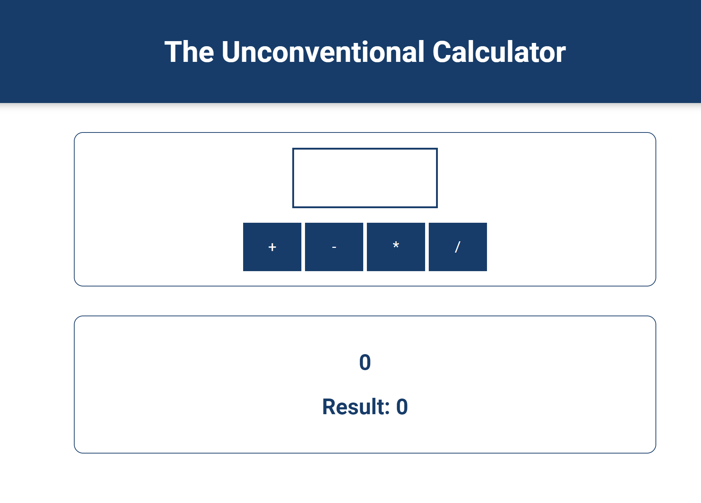

## 웹사이트에 javascript 추가하기

html head에 <script></script> 를 추가할 수도 있고 body 끝에 추가할 수도 있다.
head에 추가한다면 script가 끝나기전까지는 body가 실행되지 않으므로 렌더링 전에 script를 실행시켜야 할때 사용한다.  
일반적으로 렌더링 이후 script를 시작하므로 body 마지막에 script 태그를 추가한다.

```js
<script src='assets/scripts/vendor.js'></script>
```

## 변수, 상수

변수 let, 상수 const
변수 : 변하는 수
상수: 변하지 않는 수 -> 왜 쓰는가? 상수를 사용하면 상수를 사용하는 곳을 일괄적으로 컨트롤 할 수 있기 때문

일부 코드의 수명주기 전반에 걸쳐 절대 변하지 않은 값이 있다면, 이를 명확히 함으로써, 다른 개발자가 코드를 읽게 되었을 때 데이터가 절대 변하지 않는다는 것을 바로 알려주고 이해하기 쉽도록 해주기 때문에 const 사용을 지향해야 한다.

## 변수 네이밍 규칙

- 허용 : camelCase (권장)
  문자나 숫자만 가능
  근데 `$`, `_`는 첫글자로 올 수 있음
- 허용x : snake_case는 허용은 되지만 권장x
  숫자로시작하면 안됨
  특수문자가 틀어가면 안됨
  javascript keyword는 안됨 (let const 등)

## 자바스크립트 실행방식

스크립트를 로드할 때 위에서부터 아래로 실행을 하는데 전체 스크립트를 구문 분석하되 이를 바로 실행하는 것이 아니라 위에서부터 아애로 읽기를 합니다. 그리고 파일 내에서 함수를 찾게 되면 함수를 자동으로 맨 위로 끌고 가서 인식을 한다고 표현할 수 있습니다. 즉, 스크립트를 실행하기 전에 자동으로 모든 함수를 등록부터 하는거죠

## 그림자(Shadow) 변수

다음의 코드를 실행하면 어떻게 될까요?

```js
let userName = "Max";
function greetUser(name) {
  let userName = name;
  alert(userName);
}
userName = "Manu";
greetUser("Max");
```

사실 이 코드를 실행하면 'Max' 가 나온다.

이는 실제로 동일한 수준/동일한 범위에서는 허용되지 않습니다.

## 자료형 변환하기

문자열 형태를 숫자로 변환할 때

```js
parseInt(value);
```

을 이용하기도 하지만 단순히 앞에 `+`를 붙여도 된다.

```js
+value;
```

문자열로 변환하고 싶은 경우

```js
value.toString();
```

을 이용한다.

## 코드 나누기



userInput.value 를 받아오는 과정도 반복될 작업이기 때문에 함수의 반환으로 구현하고  
값을 `enteredValue`에 다시 할당해준다.

```js
let currentValue = 0;
const getUserInputValue = () => {
  return +userInput.value;
};
const add = () => {
  const enteredValue = getUserInputValue();
  const calcDescription = `${currentValue} + ${enteredValue}`;
  currentValue = currentValue + enteredValue;
  outputResult(currentValue, calcDescription);
};

addBtn.addEventListener("click", add);
```

`createCalcDescriptionOutput` 함수같은 helper를 작성하여 중복을 피한다.

```js
let currentValue = 0;
const getUserInputValue = () => {
  return +userInput.value;
};
const createCalcDescriptionOutput = (operator, currentValue, enteredValue) => {
  const calcDescription = `${currentValue} ${operator} ${enteredValue}`;
  outputResult(currentValue, calcDescription);
};
const add = () => {
  const enteredValue = getUserInputValue();
  const initialResult = currentValue;
  currentValue = currentValue + enteredValue;
  createCalcDescriptionOutput("+", initialResult, enteredValue);
};
const subtract = () => {
  const enteredValue = getUserInputValue();
  const initialResult = currentValue;
  currentValue = currentValue - enteredValue;
  createCalcDescriptionOutput("-", initialResult, enteredValue);
};
const multiply = () => {
  const enteredValue = getUserInputValue();
  const initialResult = currentValue;
  currentValue = currentValue * enteredValue;
  createCalcDescriptionOutput("*", initialResult, enteredValue);
};
const divide = () => {
  const enteredValue = getUserInputValue();
  const initialResult = currentValue;
  currentValue = currentValue / enteredValue;
  createCalcDescriptionOutput("/", initialResult, enteredValue);
};

addBtn.addEventListener("click", add);
subtractBtn.addEventListener("click", subtract);
multiplyBtn.addEventListener("click", multiply);
divideBtn.addEventListener("click", divide);
```

## 주석 작업하기

주석을 작업할때 명백한 내용은 피해야한다.
오히려 정보가 많아져 읽지 않기때문에 읽으면 도움이 될 정보만 간략히 적고 그 외에는 적지 않는것이 좋다.

## 객체 작업하여 로그 저장하기

```js
let logEntries = [];

const add = () => {
  const enteredValue = getUserInputValue();
  const initialResult = currentValue;
  currentValue = currentValue + enteredValue;
  const logEntry = {
    number: enteredValue,
    prevResult: initialResult,
    result: currentValue,
    operator: "ADD",
  };
  logEntries.push(logEntry);
  console.log(logEntries);
  createCalcDescriptionOutput("+", initialResult, enteredValue);
};
```

## undefined, null, NaN

- undefined : 할당된 적이 없는 값
  직접 초기화 해주면 안됨
- null : 데이터가 없음을 할당해주는 값
- NaN : 데이터 타입이 아니고 일종의 경고, `3 * 'hi'`
  와 같이 숫자가 아닌 계산을 해줄 때 발생 (Not a Number)

## typeof

데이터 타입을 알아낼 수 있는 함수
