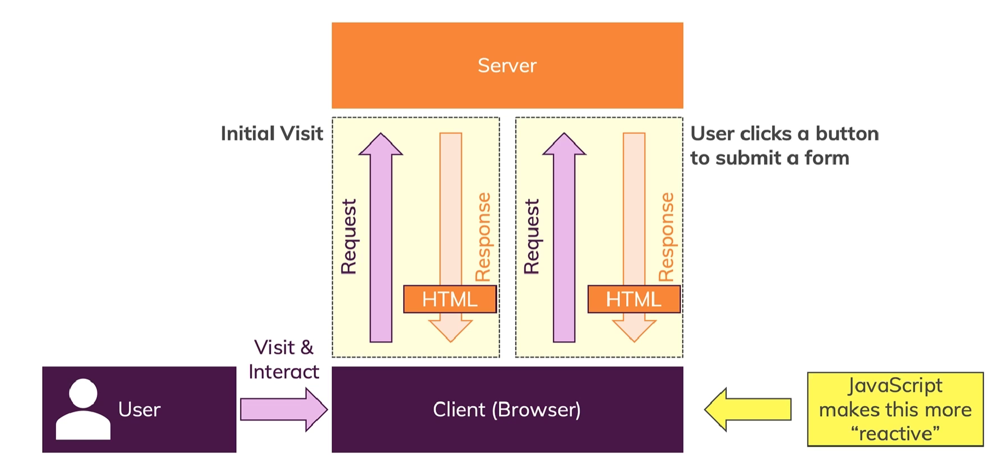
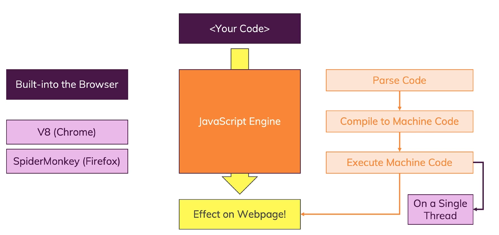
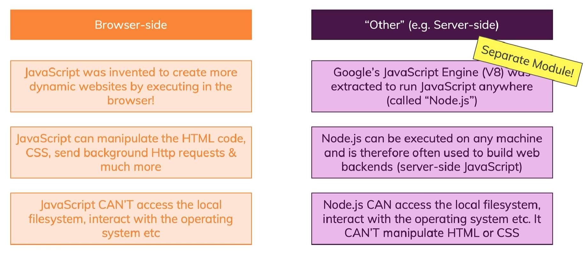

# Javascript란 무엇인가?

## javascript

런타임시 실행되는 동적 약형 (dynamic, weakly) 프로그래밍 언어. 웹 스크립트를 동적으로 컨트롤 하기 위해서 만들어짐.  
해석형 언어이기 때문에 개발중에 컴파일 되는것이 아니라 전송중에 컴파일 됨.
호스팅 된 언어이기 때문에 여러 환경에서도 실행이 됨 (브라우저)
웹페이지의 브라우저에서 코드가 실행되어 동적으로 만드는데에 사용.

## website가 동작하는 방식

다음과 같이 클라이언트가 서버에 요청을 보내면 알맞은 html을 클라이언트에게 전송.  
이 때 동적으로 html을 컨트롤 할 수 있는 언어가 javascipt

## javascript가 동작하는 방식

해석형 프로그래밍 언어 : 프로그램을 컴파일 하는 대신, 프로그램 소스 코드를 한 문장씩 직접 실행하는 프로그래밍 언어. (미리 컴파일되지 않았음을 의미)
브라우저에는 빌트인 자바스크립트 엔진이 있다. 예를들어 크롬에는 v8엔진, firefox에는 spidermonkey라는 엔진이다. 이 엔진에서 코드를 parse, 즉 분석하고 해석하여 더 빠르게 수행할 수 있는 머신코드로 바꿔준 후 실행한다. 그 코드가 실행되면 웹페이지에 영향을 미칠 수 있는 것이다.  
근데 이 엔진들은 전부 `단일 스레드`로 돌아간다..!

## 동적 약형 언어 (dynamic, weakly typed)

동적 : 런타임에 분석 해석되어 컴파일 되기 때문에 특정 작업이 가능함. 어떤 변수에 string을 지정했다가 숫자로 지정하는것이 가능(동적)
약형 : 데이터 타입을 가정하여 자동으로 유추 (데이터 타입 지정x)

## 호스팅된 환경에서 자바스크립트 실행

자바스크립트가 실행될수 있는곳 : 브라우저, 컴퓨터
브라우저 : 브라우저를 실행하면 자동으로 자바스크립트 엔진에서 js파일을 실행, 하지만 브라우저의 엔진에서 작동하는것이므로 로컬의 파일에 접근할 수 없고 운영체제와 상호작용 할수도 없음
컴퓨터 : 구글에서 브라우저의 v8엔진을 따로 떼어내어 로컬에서도 js를 실행가능하도록 함(Node.js)  
이는 브라우저와 반대로 로컬의 파일에 접근할수도있고 운영체제와 상호작용할 수도 있지만 html과 css를 조작할 수는 없음

## client-side , server-side

client side(brower) : 자바스크립트의 목적, 각자 자바스크립트 엔진을 이용하여 웹페이지와 상호작용하길 원함
server side(Nodejs) : 브라우저 밖에서 js의 지식을 재활용 하기 위함
